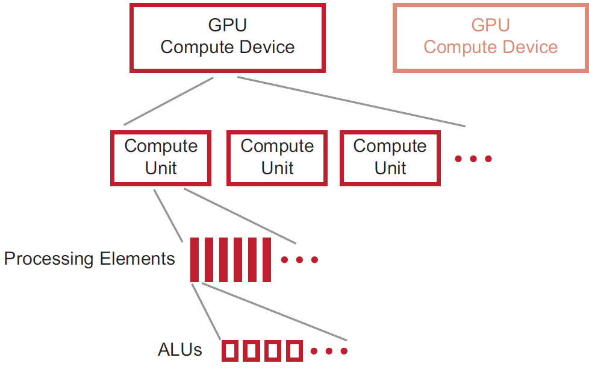
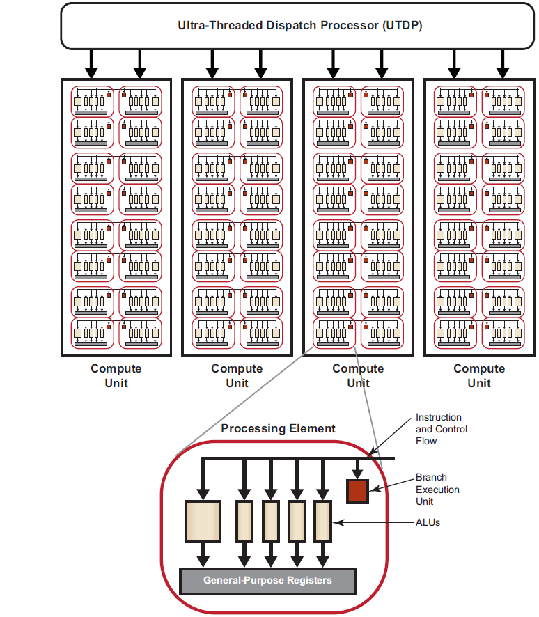
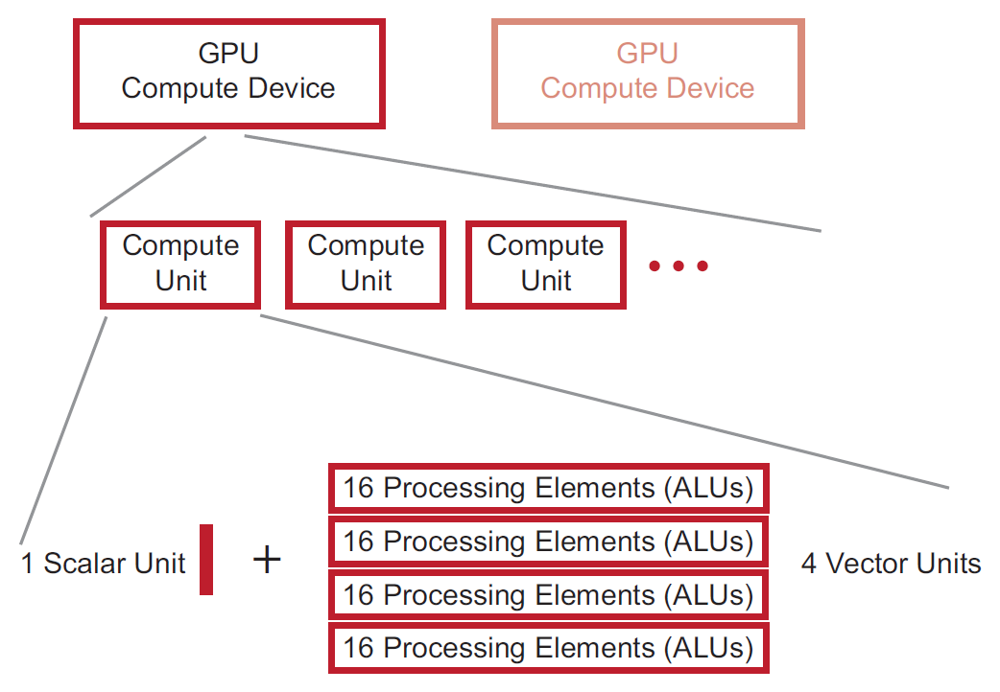
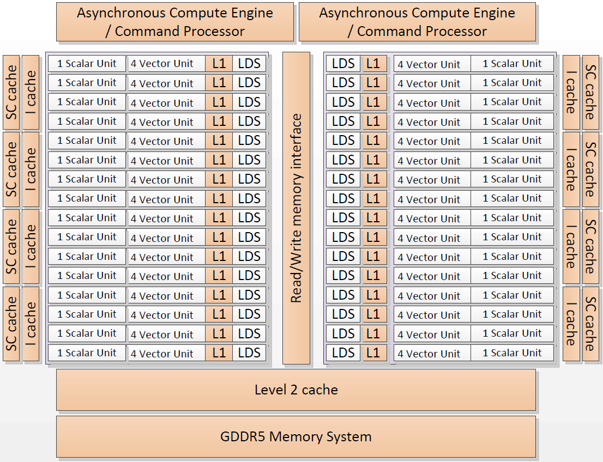

## 硬件概述（一）
本文对 Evergreen 和 Northern Islands 系列的设备进行描述，它们按照 VLIW 方式执行。

一个普通的 OpenCL 设备包含多个计算单元，每个计算单元拥有多个处理元素，每个处理元素执行一个工作项。计算单元中的处理元素使用 SIMD 方式按照 lock-step 执行，各个计算单元之间的执行相互独立。如下图所示：

AMD GPU 由多个计算单元组成，但计算单元的数目和它们的构造方式在不同系列的产品中有所不同，同系列的不同产品在设计时候也可能不同。处理元素执行 ALUs，对于 `Northern Islands` 和 `Evergreen` 系列的设备，每个处理元素中包含了 4 个 ALUs（Evergreen 系列有 5 个）。整个设备由 16 个 PEs 的阵列组成，其中包含 ALUs，每个阵列执行一条相同的指令。这些阵列以 16 个工作项为单位的块来执行单个相同的指令。该指令会重复执行 4 个周期（4 次），执行完 64 个元素的向量，称作 wavefront。在 Northern Islands 和 Evergreen 系列的设备中，PE 阵列从一个 wavefront 中取指令执行。因此，每个工作项一次发出 4 条（Northern Islands）或 5 条（Evergreen）指令，这些指令按照 VLIW 格式存放。

不同的 GPU 计算设备拥有不同的特性，但遵循相同的设计方式。下图是对 AMD `Evergreen` 系列 GPU 简单的描述：

GPU 计算设备包括一组计算单元。每个计算单元包括多个处理元素，由它来负责内核的执行，这在独立的数据流上操作。处理元素又包括多个处理元素单元，它们是计算的基础。可编程的 ALUs 可以执行整数运算、单精度浮点运算、双精度浮点运算和超越操作。对于 Evergreen 和 Northern Islands 系列的设备，计算单元中所有处理元素以 lock-step 的方式执行相同的指令序列，不同的计算单元可以执行不同的指令。

一个处理元素包含了一个 5 路或 4 路（这依赖于 GPU 的类型）的 VLIW 处理器。多达 5 个标量操作（或 4 个，依赖于 GPU 的类型）可以在一条 VLIW 指令中一起发射，每个操作对应 5 个 ALUs 中的其中一个。ALUs 可以执行单精度浮点或整数操作，5 个 ALUs 只有其中一个能执行超越操作（正玄、余玄和对数等操作）。如果是双精度浮点运算，需要其中的 2 个或 4 个 ALUs （不包括超越核心）来执行一个双精度浮点操作。处理元素还包括一个分支执行单元来处理分支指令。

不同系列的 GPU 计算设备拥有不同数量的处理元素。例如，ATI HD 5870 GPU 拥有 20 个计算单元，每个计算单元包含 16 个处理元素，每个处理元素包含了 5 个 ALUs，在物理上就拥有 1600 个 ALUs。

## 硬件概述（二）
本文对 Southern Islands 系列的设备进行介绍，它们对应 AMD GCN 架构。

OpenCL 设备包括多个计算单元（CUs），每个计算单元拥有一些子模块，最终由 ALUs 组成。工作项在 ALU 上执行，如下图所示：

对于 AMD HD79XX 系列设备，总共有 32 个计算单元，每个计算单元拥有一个标量单元和 4 个向量单元，每个向量单元包含 16 个处理元素（PEs），每个处理元素（PE）包含一个 ALU。下图只显示了阵列中的两个计算引擎/命令处理器，它构成 AMD HD 7XXX 系列的计算设备。四个向量单元使用 SIMD 来执行一个标量指令，这就允许单个 CU 就可以同时处理来自多个 wavefront 的指令。

在上图中，有两个命令处理器，它们可以同时处理来自两个命令队列的命令。标量单元、向量单元，一级数据缓存（L1）和本地数据共享（LDS）组成一个计算单元，总共有 32 个计算单元。标量（SC）缓存是标量单元的数据缓存，二级缓存包含指令和数据 。

正如上图所示，AMD HD 79XX 设备也包含一个标量单元，指令流同时包含标量和向量指令。每个周期，它选择一条标量指令和一条向量指令（如果可用，也会选择一个内存操作和分支操作），将其中的一条指令发射到标量单元，另一条发射到向量单元，总共需要 4 个周期来发送完到整个 4 个向量核（相当与 4 个周期完成后，16 个单元执行 64 个工作项）。

在 Southern Islands（AMD HD 7XXX） 系列中，这些 ALUs 组织到 4 个 SIMD 阵列中，每个包含 16 个处理元素。然而在 Northern Islands 设备（VLIW） 描述中，对于 16 个工作项为单位的每个块中，每个阵列只能执行一条指令。在 Southern Island 系列的设备中，4 个流处理器（stream core）可以执行来自 4 个不同 wavefront 的代码。

