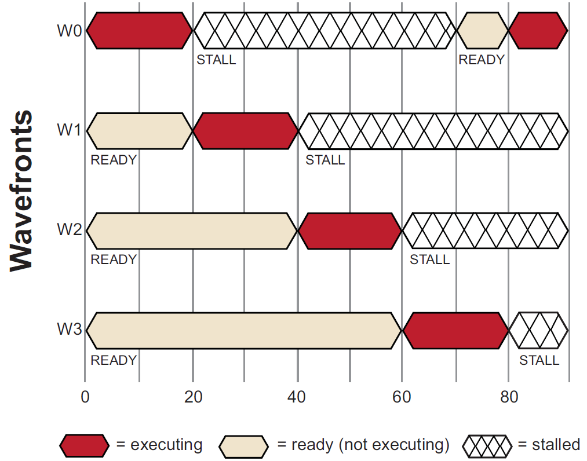
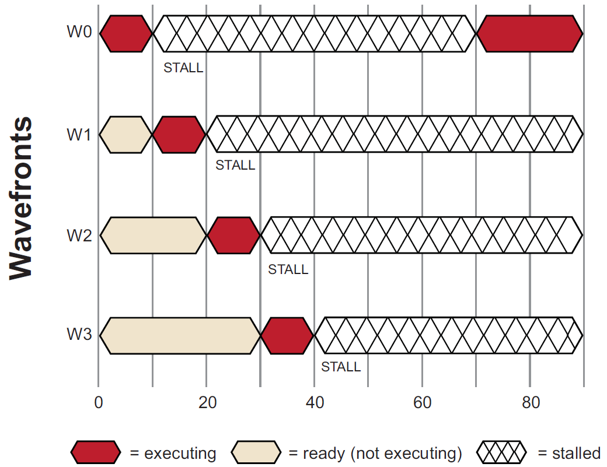

## GPU 计算设备调度

GPU 计算设备在并行处理大量的工作项时非常的高效，整个过程对应用程序透明。每个 GPU 计算设备使用大量的 wavefronts 来隐藏内存访问的延迟。在一个计算单元中，正在执行的 wavefront 等待内存访问完成时，可以通过资源调度器切换到另一个活动的 wavefront 执行。隐藏内存访问的延迟要求在内存执行加载/存储操作时，每个工作项包含大量的 ALU 操作。

下图显示了在单个计算单元中，简化了的 wavefronts 的执行时序。在开始的 `0` 时刻，wavefronts 排入队列中，等待执行。这
个例子中，只有 4 个 wavefronts（T0...T3）用于计算单元调度。硬件限制了程序执行过程中活动 wavefront 的数量，这依赖资源的使用情况（例如活动寄存器使用的数量），优秀的可编程计算设备通常拥有多个活动的 wavefronts。

开始执行后，wavefront T0 执行到 20 个时钟周期。这时，由于内存访问请求发生了一个 stall，调度器接着开始执行下一个 wavefront T1。Wavefront T1 执行后，直到它被 stall 或执行完成。新的 wavefronts 开始执行，这个过程一直持续，直到达到可以执行的 wavefronts 的数量。最后调度器然后返回第一个 wavefront 执行 T0。

如果 wavefront T0 等待的数据已返回，T0 将继续执行。在上图的例子中，数据已经准备就绪，因此 T0 继续开始执行。由于有足够
的 wavefronts 和处理元素操作来填充较长的内存延迟访问，计算单元并不会进入空闲状态。该内存延迟隐藏的方法帮助 GPU 计算单元获得了最大的性能。

如果 T0-T3 中没有一个处于运行状态（就绪状态），计算单元将等待（stall），直到 T0-T3 中有一个 wavefront 处于就绪状态。在
下图中，T0 第一个开始继续执行：

