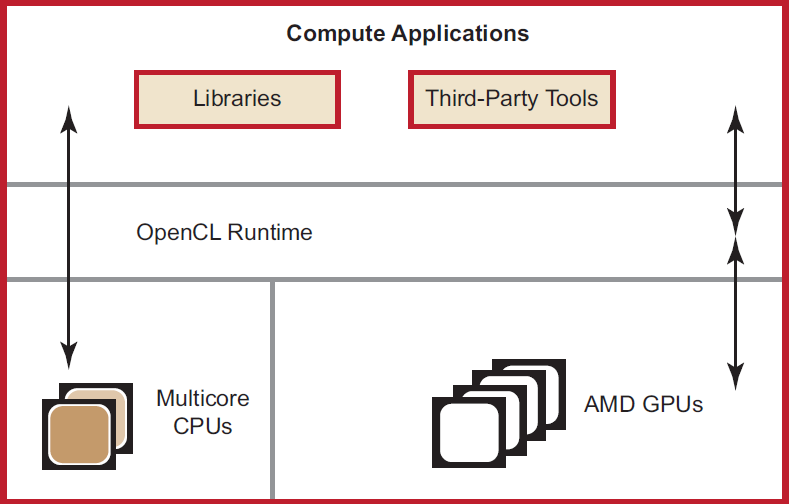
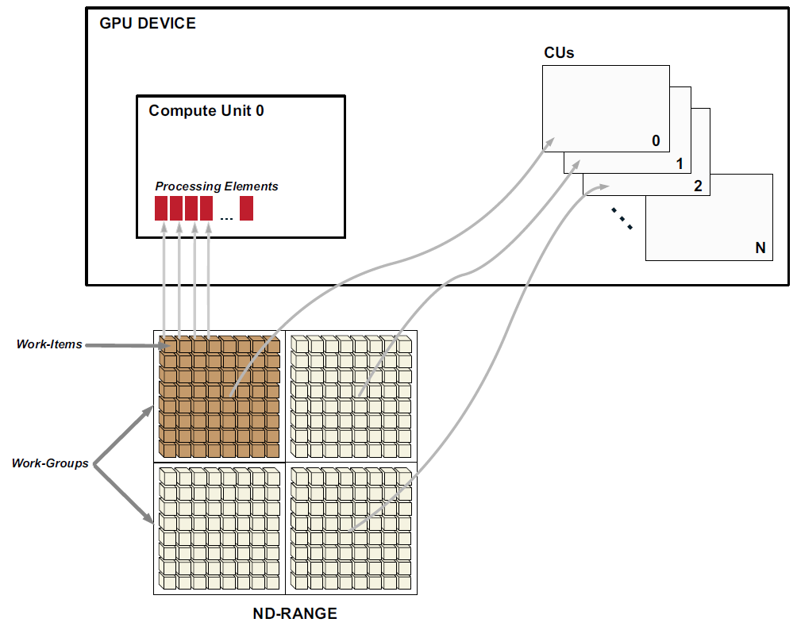
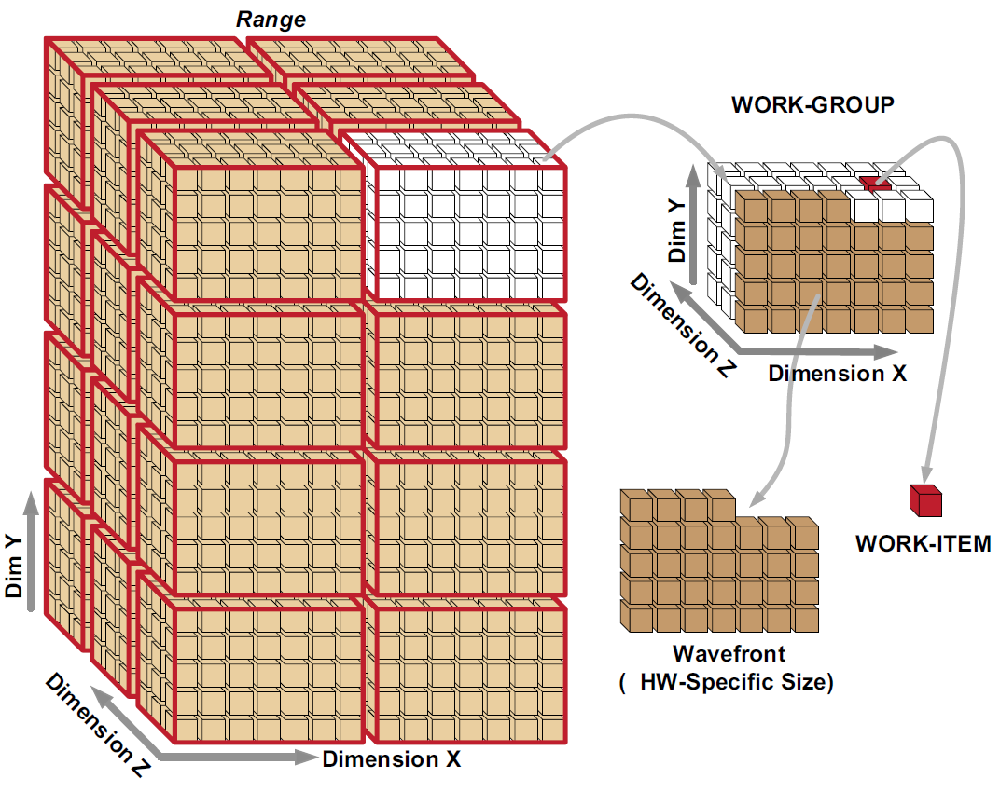
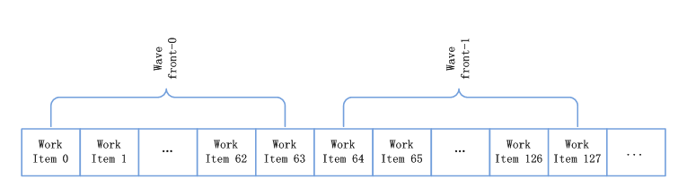
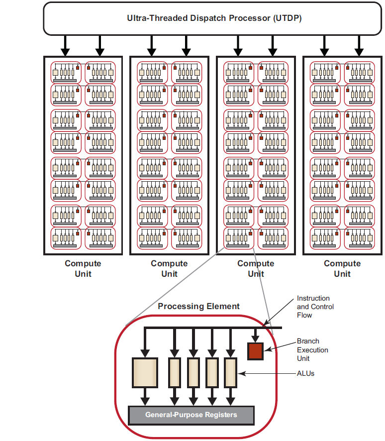

## AMD APP 对 OpenCL 的支持

AMD APP（Accelerated Parallel Processing） 利用 GPU 强大的处理能力，来为广泛的高性能、数据并行计算应用提供服务。AMD APP 系统包括一个软件栈、AMD GPUs 和多核 AMD CPUs。下图描述了 AMD APP 中不同组成部分之间的关系：



AMD APP 软件栈为终端用户和开发人员提供了一套完整、灵活的工具包，以充分利用 AMD GPUs 的处理能力。软件包括下面的部分：
- OpenCL 编译器和运行库；
- 调试和性能分析工具，AMD CodeXL；
- 高性能库。AMD APP 数学库（APPML），以优化 NDRange 相关的算法。

新一代的 AMD GPUs 使用统一着色器架构，可以在同一个硬件上交织运行不同功能类型的程序。可编程的 GPU 计算设备可以执行用户开发的不同程序，对于图形开发人员，我们把这些程序称为`着色器程序`；对于并行计算程序的开发人员，我们称作`内核程序`。使用数据并行编程模型，GPU 计算设备可以执行和图形无关的功能，这需要将执行的任务映射到计算单元。这种编程模型，称作 AMD APP（Accelerated Parallel Processing）。

运行在计算单元上的内核实例称作工作项。该概念和 Linux 系统环境下进程有些类似，运行在 cpu 上的程序实例称作进程，但是在 Linux 中进程可以作为调度单位，而在 AMD 的 GPU 中，调度单位是 wavefront，新一代的架构中它包含了 64 个工作项。工作项映射到一个 `n-维` 的索引空间，称作 NDRange。在执行工作项的时候，可以对每个维度的工作项进行单独的引用。

GPU 调度一定数量工作项到一组处理元素（processing element）上处理，直到所有的工作项处理完成。接着，可以执行内核程序，直到应用执行完成。 下图呈现了 AMD APP 的编程模型，以及如何将工作项映射到处理元素：



工作组被分配到计算单元上执行。同一工作组中的所有工作项只能被相同 CU 中的处理元素处理，而且一个处理元素在同一时刻只能处理一个工作项，但是一个 CU 可以处理多个工作组。

OpenCL 把所有将要执行的工作项映射到一个`n-维` 网格（NDRange）。开发人员可以指定如何将这些工作项划分到不同的工作组中。例如，可以根据任务的属性来指定。AMD 的 GPU 基于 wavefronts 执行（多个工作组在计算单元上以 lock-step 的方式执行），每个工作组包含整数个 wavefronts。如下图所示，在 AMD APP 环境中，硬件调度工作项执行的时候包括一个中间步骤，用来指定一个工作组中的 wavefronts，以在 AMD GPUs 上能获得最大性能。



在 `n-维`索引空间（NDRange）中，每个维度可以包含多个工作组，每个工作组中有一定数量的工作项，多个工作项构成一个 wavefront。计算单元中 wavefronts 的数量由硬件决定。

## 执行工作项
老的计算设备中，一个计算单元中所有的处理元素在同一周期执行相同的指令。一个工作项在每个时钟周期可以发射一条指令，当多个工作项（以块为单位）一起执行时称作 `wavefront`。wavefront 可看作一个调度单位，这样可以更好的利用硬件资源，来获得最大性能。为了隐藏由于内存访问和处理元素的执行带来的延迟，单个 wavefront 中多达 4 个工作项以流水线（pipelined）的方式在同一个流处理器（stream core）上执行。例如，在 AMD 7970 GPU 计算设备上，一个计算单元中的 16 个处理元素（PEs）分四个周期来执行相同的指令，这表现为计算单元执行能力的宽度为 64-wide。对于硬件指定的 wavefront，四个周期可以执行完 wavefront 中的所有工作项的同一条指令。

在不同的 GPU 计算设备上，wavefronts 的大小可能不同。例如，一些低端和旧版本的 GPUs，像 AMD 54XX 系列的图形卡，它对应的 wavefront 大小为 32 个工作项。高端和较新一代的 AMD GPUs， 对应的 wavefront 包含 64 个工作项。

计算单元之间的操作相互独立。因此，对于不同的计算单元它们执行的指令可能不同。

在讨论流控之前，澄清 wavefront 和工作组之间的关系非常重要。在用户定义的工作组中，一个工作组它包含了一个或多个 wavefronts。wavefront 是一个硬件线程，它包含了自己的程序计数器（program count），可以用来跟踪流控，这和其它的 wavefront 相互独立。一个 wavefront 包含的工作项数目小于或等于 64。对 wavefront 的映射基于线性的工作项顺序，在一个 wavefront 为 64 的设备上，工作项 0-63 映射到 wavefront 0，工作项 64-127 映射到 wavefront 1，以此类推。为了充分的利用硬件，建议工作项的数目是 wavefront 的倍数。对 wavefront 的映射如下图所示：



### 创建工作项
对于每个工作组，GPU 计算设备在单个计算单元中分配请求的 wavefronts 的数目。如果在一个 wavefront 中拥有没有活动的工作项，则映射到这些工作项的流处理器处于空闲（idle）状态。例如，当一个工作组的大小不是 wavefront 的整数倍时（工作组的大小是 32，wavefront 为 64 时，此时 wavefront 有一半是空闲的并且没有使用）。

### 流控
流控，例如分支，其实现是将所有可能的路径组合当作一个 wavefront。一个 wavefront 中的某些工作项走了不同分支，所有的路径都将串行执行。例如，一个工作项包含不同路径的分支，该 wavefront 首先执行第一个路径，接着执行第二个路径。执行这个分支的总时间是两条路径相加的结果。需要明确的是，即使 wavefront 中只有一个工作项执行了分支，该 wavefront 中剩下的工作项也将执行该分支。在一个分支中，必须执行的工作项数目称作分支粒度（branch granularity）。在 AMD 硬件中，分支粒度的大小和 wavefront 中的工作项数目相等。

在下面的代码中，x 通过掩码操作后表示 wavefront 中不同的工作项：
```c
if (x)
{
	// items within these braces = A
	... ...
}
else
{
	// items within these braces = B
}
```

当 x 表达式的值为 true 时，wavefront 中对应的工作项掩码值设置为 true，此时执行 A。反之，如果的值为 false，将执行 B。

例1：如果两个分支 A 和 B，花费相同的时间 t 来执行一个 wavefront。如果有某个工作项走了不同的分支，则总的时间为 2t；

循环执行的方式类似，只要 wavefront 中仍然有工作项在处理，wavefront 将占用这个计算单元。因此，wavefront 总的执行时间，由 wavefront 中执行最长时间的工作项决定。

例2：如果 t 是一个循环中执行单次迭代所花费的时间；在一个 wavefront 中，除了一个工作项执行 100 次循环，其它的所有工作项执行一次这个循环，则执行整个 wavefront 所花费的时间为 100t。

## 硬件概述（一）
这部分 Evergreen 和 Northern Islands 系列的设备进行描述，它们按照 VLIW 方式执行指令。

一个普通的 OpenCL 设备包含多个计算单元，每个计算单元拥有多个处理元素，每个处理元素执行一个工作项。计算单元中的处理元素使用 SIMD 方式按照 lock-step 执行，各个计算单元之间的执行相互独立。如下图所示：


AMD GPU 由多个计算单元组成，但计算单元的数目和它们的构造方式在不同系列的产品中有所不同，同系列的不同产品在设计时也可能不同。处理元素执行 ALUs，对于 `Northern Islands` 和 `Evergreen` 系列的设备，每个处理元素中包含了 4 个 ALUs（Evergreen 系列有 5 个）。整个设备由 16 个 PEs 的阵列组成，其中包含 ALUs，每个阵列执行一条相同的指令。这些阵列以 16 个工作项为单位的块来执行单个相同的指令。该指令会重复执行 4 个周期（4 次），执行完 64 个元素的向量，称作 wavefront。在 Northern Islands 和 Evergreen 系列的设备中，PE 阵列从一个 wavefront 中取指令执行。因此，每个工作项一次发出 4 条（Northern Islands）或 5 条（Evergreen）指令，这些指令按照 VLIW 格式存放。

不同的 GPU 计算设备拥有不同的特性，但遵循相同的设计方式。下图是对 AMD `Evergreen` 系列 GPU 简单的描述：



GPU 计算设备包括一组计算单元。每个计算单元包括多个处理元素，由它来负责内核的执行，这在独立的数据流上操作。处理元素又包括多个处理元素单元，它们是计算的基础。可编程的 ALUs 可以执行整数运算、单精度浮点运算、双精度浮点运算和超越函数。对于 Evergreen 和 Northern Islands 系列的设备，计算单元中所有处理元素以 lock-step 的方式执行相同的指令序列，不同的计算单元可以执行不同的指令。

一个处理元素包含了一个 5 路或 4 路（这依赖于 GPU 的类型）的 VLIW 处理器。多达 5 个标量操作（或 4 个，依赖于 GPU 的类型）可以在一条 VLIW 指令中一起发射，每个操作对应 5 个 ALUs 中的其中一个。ALUs 可以执行单精度浮点或整数操作，5 个 ALUs 只有其中一个能执行超越函数（正玄、余玄和对数等操作）。如果是双精度浮点运算，需要其中的 2 个或 4 个 ALUs （不包括超越核心）来执行一个双精度浮点操作。处理元素还包括一个分支执行单元来处理分支指令。

不同系列的 GPU 计算设备拥有不同数量的处理元素。例如，ATI HD 5870 GPU 拥有 20 个计算单元，每个计算单元包含 16 个处理元素，每个处理元素包含了 5 个 ALUs，在物理上就拥有 1600 个 ALUs。

## 硬件概述（二）
这部分对 Southern Islands 系列的设备进行介绍，它们对应 AMD GCN 架构。

OpenCL 设备包括多个计算单元（CUs），每个计算单元拥有一些子模块，最终由 ALUs 组成。工作项在 ALU 上执行，如下图所示：


对于 AMD HD79XX 系列设备，总共有 32 个计算单元，每个计算单元拥有一个标量单元和 4 个向量单元，每个向量单元包含 16 个处理元素（PEs），每个处理元素（PE）包含一个 ALU。下图只显示了阵列中的两个计算引擎/命令处理器，它构成 AMD HD 7XXX 系列的计算设备。四个向量单元使用 SIMD 来执行一个标量指令，这就允许单个 CU 就可以同时处理来自多个 wavefront 的指令。


在上图中，有两个命令处理器，它们可以同时处理来自两个命令队列的命令。标量单元、向量单元，一级数据缓存（L1）和本地数据共享（LDS）组成一个计算单元，总共有 32 个计算单元。标量（SC）缓存是标量单元的数据缓存，二级缓存包含指令和数据 。

正如上图所示，AMD HD 79XX 设备也包含一个标量单元，指令流同时包含标量和向量指令。每个周期，它选择一条标量指令和一条向量指令（如果可用，也会选择一个内存操作和分支操作），将其中的一条指令发射到标量单元，另一条发射到向量单元，总共需要 4 个周期来发送完到整个 4 个向量核（相当与 4 个周期完成后，16 个单元执行 64 个工作项）。

在 Southern Islands（AMD HD 7XXX） 系列中，这些 ALUs 组织到 4 个 SIMD 阵列中，每个包含 16 个处理元素。然而在 Northern Islands 设备（VLIW） 描述中，对于 16 个工作项为单位的每个块中，每个阵列只能执行一条指令。在 Southern Island 系列的设备中，4 个流处理器（stream core）可以执行来自 4 个不同 wavefront 的代码。

