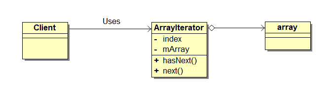
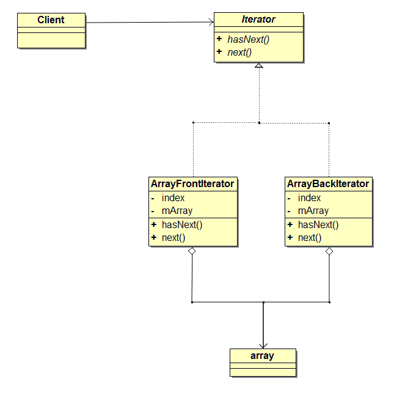
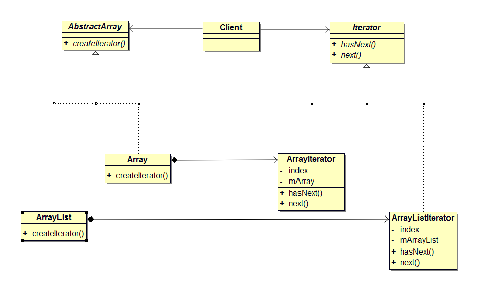
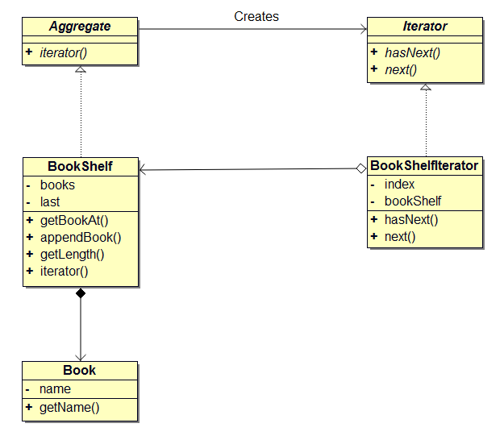
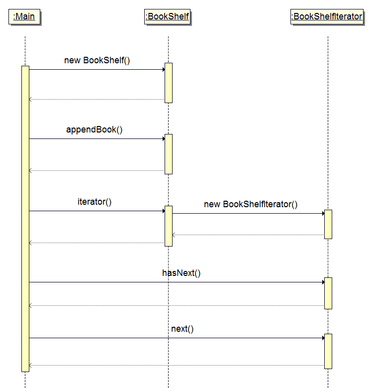
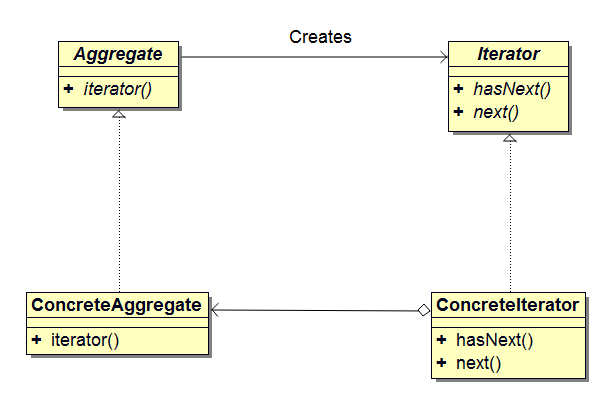

## 前言
使用 Java 语言访问数组 array 中的元素时，我们可以通过下面的 for 循环语句遍历数组。
```java
int array[] = {1, 2, 3, 4, 5, 6, 7, 8, 9, 10};

for (int i = 0; i < array.length; i++) {
	System.out.print(array[i]);
}
```
这是我们常用的方式。在这种方式中，数组直接暴露给客户，客户在访问数组的元素时需要自己实现遍历算法。也就说当我们改变遍历策略时，客户程序也要跟着调整。例如，我们将从前往后遍历调整为从后向前的遍历方式，这时 for 循环语句需要做相应修改。

## 迭代器
是否存在这样一种方式，当改变遍历策略时，客户访问集合中元素的方式不需要做相应改变。答案是有的，通过将 for 循环语句抽象后，得到 Iterator 模式。Iterator 模式提供了一种方式，客户可以按照特定顺序访问集合对象中的元素，而不需要暴露集合的内部细节。

例如，我们将 for 循环语句抽象化后得到 ArrayIterator 类，建立如下 array 数组和 ArrayIterator 类的关系。

<center></center>

在实例化 ArrayIterator 类时，需要将 array 对象作为参数传递给 ArrayIterator 的构造函数，用于遍历。实例化 ArrayIterator 之后，就可以通过下面的代码访问数组中的元素。hasNext 用于测试是否已经完成了对 array 对象的遍历；next 返回 array 对象中当前 index 指向的元素，并使 index 指向下一个元素。

```java
int array[] = {1, 2, 3, 4, 5, 6, 7, 8, 9, 10};

ArrayIterator it = new ArrayIterator(array);

while (it.hasNext()) {
	System.out.print(it.next());
}
```

将遍历机制分离到 ArrayIterator 类中实现后，客户可以在无需更改上面代码的情况下重新定义不同的遍历策略。例如，通过对 ArrayIterator 类中已有接口重新实现就可以从后向前遍历数组 array 中的元素。

面向对象编程的一个主要优势就是代码复用。当使用上面的访问方式时，如果更改遍历策略，就需要重新实现 ArrayIterator 类中的方法，已有的代码将被修改不能复用。为了能让程序支持多种遍历方式，我们可以将 ArrayIterator 中的通用方法抽象为接口，在不同的遍历策略中分别实现该接口。

<center></center>

使用这种方式客户只需关心 Iterator 接口提供的抽象方法，而不需要了解 ArrayFrontIterator 和 ArrayBackIterator 类的实现细节。针对接口而不是具体实现编程弱化了类之间的耦合，从而使类更容易被重用。

同理，在不同的集合中我们也可以抽象出公共接口 createIterator()，以创建迭代器对象。这样不管是 Array 还是 ArrayList 集合我们都能使用同一个接口类型获得迭代器对象来遍历集合对象中的成员，这称作多态迭代。

<center></center>

## 示例程序
下面是实现了 Iterator 模式的示例程序。这段示例程序的作用是将书（Book）放置到书架上，并将书的名字按照顺序显示出来。

### 类图

<center></center>

### 类和接口列表

名称               | 描述
------------------|------------------------------
Aggregate         |表示集合的接口
Iterator          |遍历集合的接口
Book              |表示书的类
BookShelf         |表示书架的类
BookShelfIterator |遍历书架的类
Main              |测试程序类

### 代码
#### Aggregate 接口
```java
// 该接口只声明了一个 iterator 方法，此方法会生成用于遍历集合的迭代器
public interface Aggregate {
	Iterator iterator();
}
```
在 Aggregate 接口中只声明了一个 iterator 抽象方法，该方法会创建用于遍历集合的迭代器。当需要遍历集合对象中的元素时，通过调用 iterator 方法可以创建一个实现了 Iterator 接口的类的实例。

#### Iterator 接口
Iterator 接口用于遍历集合中的元素，其作用相当于 for 循环语句。为了简单明了，我们在 Iterator 接口中只声明了两个方法。hasNext 用于判断是否已完成对集合的遍历，next 用于获取下一个元素。
```java
public interface Iterator {
	boolean hasNext();
	Object next();
}
```

#### Book 类
表示书籍的类。该类只包含了一个方法——getName 用于获取书名。书的名字在实例化 Book 类时通过参数传递给构造函数。
```java
public class Book {
	private String name;

	public Book(String name) {
		this.name = name;
	}

	public String getName() {
		return name;
	}
}
```

#### BookShelf 类
表示书架的类。该类实现了 Aggregate 接口，在程序中我们将它当作集合处理。
```java
public class BookShelf implements Aggregate {
	private Book[] books;
	private int last = 0;

	// books 数组的大小在生成 BookShelf 实例时被指定，和 BookShelf 为组合关系
	public BookShelf(int maxsize) {
		this.books = new Book[maxsize];
	}

	public Book getBookAt(int index) {
		return books[index];
	}

	public void appendBook(Book book) {
		this.books[last] = book;
		last++;
	}

	public int getLength() {
		return last;
	}

	// 生成并返回 BookShelfIterator 的实例，作为 BookShelf 类的 Iterator
	public Iterator iterator() {
		return new BookShelfIterator(this);
	}
}
```
代码中将 books 字段的可见性设置为 private，这可以防止外部对该字段的访问。iterator 方法生成并返回 BookShelfIterator 类的实例。当客户需要遍历书架时，可以调用 iterator 方法。

#### BookShelfIterator 类
该类用于遍历书架。bookShelf 字段表示  BookShelfIterator 将要遍历的书架，index 字段表示迭代器当前所指向的书下标。注意，BookShelfIterator 和 BookShelf 是耦合的。
```java
// 迭代书架上的书。在构造函数中，书架（集合）作为参数传入
public class BookShelfIterator implements Iterator {
	// 书架，以及指向当前书的下标
	private BookShelf bookShelf;
	private int index;

	// 构造对象时初始化私有字段，和 BookShelf 为聚合关系
	public BookShelfIterator(BookShelf bookShelf) {
		this.bookShelf = bookShelf;
		this.index = 0;
	}

	// 判断是否完成对书架的遍历
	public boolean hasNext() {
		if (index < bookShelf.getLength()) {
			return true;
		} else {
			return false;
		}
	}

	// 返回当前所指向的书，并让迭代器指向下一本书
	public Object next() {
		Book book = bookShelf.getBookAt(index);
		index++;
		return book;
	}
}
```

#### Main 类
设计了一个能放置 4 本书的书架，然后按照书名的字母顺序依次向书架上放入书籍。
```java
public class Main {
	public static void main(String[] args) {
		BookShelf bookShelf = new BookShelf(4);
		bookShelf.appendBook(new Book("Around the World in 80 Days"));
		bookShelf.appendBook(new Book("Bible"));
		bookShelf.appendBook(new Book("Cinderella"));
		bookShelf.appendBook(new Book("Daddy-Long-Legs"));

		// 这里使用了接口类型作为返回类型
		Iterator it = bookShelf.iterator();
		while (it.hasNext()) {
			Book book = (Book)it.next();
			System.out.println(book.getName());
		}
	}
}
```
通过 bookShelf.iterator() 得到的 it 是用于遍历书架的 Iterator 实例。只要还没有完成对书架的遍历，while 循环就不会停止。程序会通过 it.next() 一本一本的遍历书架上的书。

#### 运行结果
下面是程序执行后的结果输出。
```bash
Around the World in 80 Days
Bible
Cinderella
Daddy-Long-Legs
```

### 时序图

<center></center>

上图为该程序运行时的时序图，它用图示的方式展示了多个对象之间的行为。时序图的阅读顺序是沿着生命线从上往下阅读，当遇到箭头时，可以顺着箭头所指的方向查看对象间的协作。

## 模型和角色
读完示例程序后，下面我们看看 Iterator 模式的模型。

<center></center>

接下来我们看看模型中规定的角色。在这个系列的文章中，角色指设计模式中出现的类、接口和实例在模式中所起的作用。例如在一个家庭中，有爸爸、妈妈、爷爷和奶奶等角色。不管他们叫什么名字，角色的名称不会变，他规定了每个人在家庭中的职责。Iterator 模式中包含了如下角色。

### Iterator（迭代器）
定义遍历集合元素的接口。在示例程序中，由 Iterator 接口扮演这个角色，它声明了 hasNext 和 next 两个方法。其中，hasNext 用于判断是否已完成对集合的遍历，next 方法用于获取集合元素。

### ConcreteIterator（具体迭代器）
实现 Iterator 角色所定义的接口。在示例程序中，由 BookShelfIterator 类扮演这个角色。该角色中包含了遍历集合所必需的信息。在示例程序中，BookShelf 类的实例保存在 bookShelf 字段中，BookShelf 和 BookShelfIterator 类构成聚合关系。当前指向的书的下标保存在 index 字段中。

### Aggregate（集合）
定义创建 Iterator 角色的接口。在示例程序中，由 Aggregate 接口扮演这个角色，它声明了 iterator 方法。

### ConcreteAggregate（具体集合）
实现 Aggregate 角色中定义的接口，它会创建 ConcreteIterator 角色。在示例程序中，由 BookShelf 扮演这个角色，它实现了 iterator 方法。

## 意义
使用迭代器模式，主要有下面三个优势。

- 同一个集合可以支持不同的遍历策略。迭代器在改变遍历策略时非常方便，可以直接替换原有的迭代器实例，也可以声明一个迭代器子类来支持新的遍历方式；
- 简化了集合的接口。集合可以更集中于元素的处理（例如 add、remove 和 isEmpty 等）。遍历相关的接口不需要在集合中实现；
- 集合可以支持多个遍历同时进行。每个迭代器实例都会保存自己的遍历状态，多个遍历同时进行时互不干扰。

## 参考

- Design Patterns : Elements of Reusable Object-Oriented Software
- 图解设计模式


