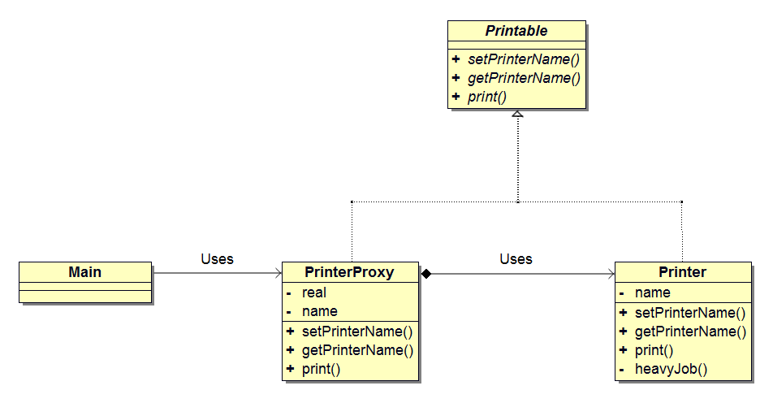
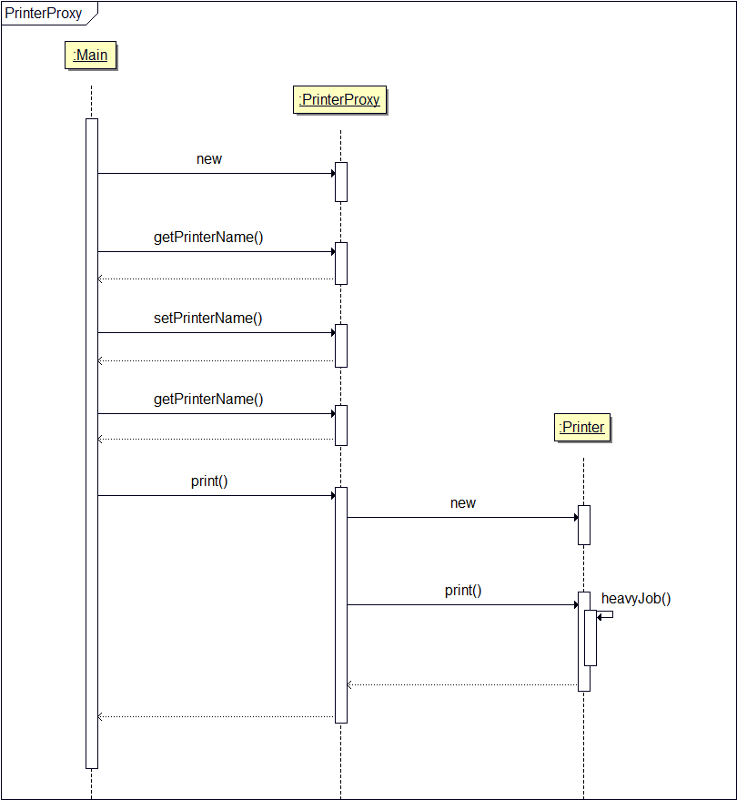
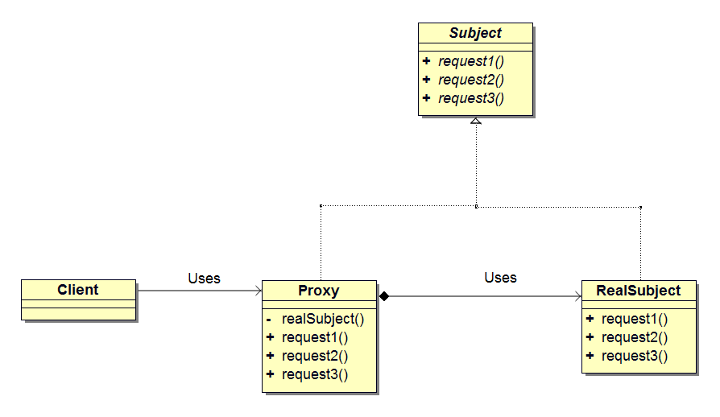

## 前言
使用文档编辑器打印文件时，通常会先打开文件浏览一下内容，确认是我们期望的。如果在打开文件时做一些耗时的初始化工作——例如打印机初始化，就会影响浏览文件时的阅读体验。为了不影响阅读体验，我们可以将打印机的初始化延迟，等到打印文件的时候再初始化。这可以通过在实例化打印机之前增加一个中间层来控制对打印机的访问。

## 代理模式
当访问一个对象时，引入中间层（代理人）来控制对这个对象的访问——这相当于间接访问该了目标对象。这种通过中间层来控制访问对象的模式称作代理（Proxy）模式。

所谓代理，是指受当事人的委托，代表当事人在授权范围内处理事务。而代理模式中的代理人则是把事务委托给当事人处理，当事人是真正处理事务的对象。

## 示例程序
下面是一段使用了代理模式的示例程序。这段示例程序实现了一个`带名字的打印机`。该打印机的功能是往显示终端输出字符串。

首先，我们在 Main 类中生成 PrinterProxy 类的实例（代理人）的同时设置实例的名字为 `Alice`，接着在终端显示该名字。然后会将实例名字改为 Bob，接着显示该名字。在设置和获取名字时，都不会生成 Printer 类的实例（当事人），而是由 PrinterProxy 类代理负责处理。最后，我们调用 print 方法，启动打印机开始打印时，PrinterProxy 类才会生成 Printer 类的实例。

为了让 PrinterProxy 类与 Printer 类的接口具有一致性，我们定义了 Printable 接口。示例程序的前提是`生成 Printer 类的实例`需要花费较长时间。为了在程序中体现这一点，我们在 Printer 类的构造函数中调用了 heavyJob 方法，让它处理一些繁重的任务。下面是相关类和接口的列表。

### 类和接口列表

名称              | 描述
------------------|--------------------------------------------
Printer           |表示带名字的打印机的类（当事人）
Printable         |Printer 和 PrinterProxy 的共同接口
PrinterProxy      |表示带名字的打印机的类（代理人）
Main              |测试程序行为的类

### 类图

<center></center>

### 代码
#### Printer 类
Printer 表示`当事人`的类，它实现了 Printable 接口，负责具体的事务处理。
```java
public class Printer implements Printable {
	private String name;

	public Printer() {
		heavyJob("Creating Printer's instance ");
	}

	public Printer(String name) {
		this.name = name;
		heavyJob("Creating Printer's instance (" + name + ") ");
	}

	public void setPrinterName(String name) {
		this.name = name;
	}

	public String getPrinterName() {
		return name;
	}

	public void print(String string) {
		System.out.println("===" + name + "===");
		System.out.println(string);
	}

	private void heavyJob(String msg) {
		System.out.print(msg);
		for (int i = 0; i < 5; i++) {
			try {
				Thread.sleep(1000);
			} catch (InterruptedException e) {
			}
			System.out.print(".");
		}
		System.out.println(" End.");
	}
}
```
在构造函数中，我们通过调用 heavyJob 方法让它做一些`繁重的任务`。setPrinterName 方法用于设置打印机的名字，getPrinterName 用于获取打印机的名字，print 方法用于在终端上显示打印机的名字。heavyJob 方法负责处理 5 秒钟的`繁重任务`，它每秒显示一个点号来表示当前干活的进度。

#### Printable 接口
Printable 接口使 Printer 类和 PrintProxy 类的接口具有一致性。setPrinterName 方法用于设置打印机的名字，getPrinterName 用于获
取打印机的名字，print 用于在显示终端输出字符串。
```java
public interface Printable {
	public abstract void setPrinterName(String name);
	public abstract String getPrinterName();
	public abstract void print(String string);
}
```

#### PrintProxy 类
PrintProxy 类表示`代理人`的类，它实现了 Printable 接口，是代理模式的核心。

name 字段中保存了打印机的名字，real 字段中保存的是`当事人`的对象。在构造函数中只是保存打印机的名字，此时还不会生成`当事人`的实例。setPrinterName 方法用于设置新的打印机的名字。如果 real 字段不为 null（已经生成了`当事人`的实例），那么设置`当事人`的名字。当 real 字段为 null 时，则将名字保存在 name 字段中，在生成`当事人`实例时作为构造函数的参数。getPrinterName 返回 name 字段的值。print 方法将工作转交给`当事人`处理，它会调用 realize 方法来生成`当事人`类的实例。在调用 realize 方法后，real 字段会保存`当事人`（Printer 类的实例）对象。接着调用 real.print 方法将工作交给`当事人`处理。

不管 setPrinterName 和 getPrinterName 方法被调用多少次，都不会生成 Printer 类的实例。只有在真正需要执行打印任务时，才会
生成 Printer 类的实例。realize 方法很简单，当 real 字段为 null 时，它会使用 new Printer 来生成 Printer 类的实例。如果 real 字段不为 null，则什么也不做。
```java
public class PrinterProxy implements Printable {
	private String name;
	private Printer real;

	// 构造函数
	public PrinterProxy() {
	}

	public PrinterProxy(String name) {
		this.name = name;
	}

	public synchronized void setPrinterName(String name) {
		if (real != null) {
			real.setPrinterName(name); // 同时设置当事人的名字
		}

		this.name = name; // 设置代理人的名字
	}

	public String getPrinterName() {
		return name;
	}

	public void print(String string) {
		realize(); // 实现
		real.print(string);
	}

	// 生成当事人的实例
	private synchronized void realize() {
		if (real == null) {
			real = new Printer(name);
		}
	}
}
```

#### Main 类
Main 类通过 PrintProxy 类来间接使用 Printer 类。Main 类首先会生成 PrintProxy 类的实例，保存为 Printable 接口类型。然后调用
getPrinterName 方法获取打印机的名字并显示。接着通过 setPrinterName 方法重新设置打印机的名字。最后，调用 print 方法在显示终端输出 `Hello, world!` 字符串。
```java
public class Main {
	public static void main(String[] args) {
		Printable p = new PrinterProxy("Alice");
		System.out.println("Printer's name is " + p.getPrinterName() + ".");
		p.setPrinterName("Bob");
		System.out.println("Printer's name is " + p.getPrinterName() + ".");
		p.print("Hello, world!");
	}
}
```

#### 运行结果
示例程序的运行结果如下。
```java
xbdong@xbdong-opencl:~/Project/github/No.21_UMLProxy$ sh build.sh
Printer's name is Alice.
Printer's name is Bob.
Creating Printer's instance (Bob) ..... End.
===Bob===
Hello, world!
```

> 注意，在设置名字和显示名字的时候，并没有生成 Printer 类的实例，直到调用 print 方法时，才生成 Printer 类的实例。

### 时序图

<center></center>

## 模型和角色
读完示例程序后，下面我们看看代理模式的模型图。

<center></center>

下面是模型中规定的角色。

### Subject（当事人）
Subject 角色定义了 Proxy 角色和 RealProxy 角色之间的一致性接口。由于存在 Subject 角色，Client 角色不必在意它所使用的究竟是 Proxy 角色还是 RealProxy 角色。在示例程序中，由 Printable 接口扮演此角色。

### Proxy（代理人）
Proxy 角色会尽量处理来自 Client 角色的请求，只有当自己不能处理时，它才会将工作转交给 RealProxy 角色来处理。Proxy 角色
只有在必要时才会生成 RealProxy 角色，它实现了在 Subject 角色中定义的接口。在示例程序中，由 PrinterProxy 类扮演此角色。

### RealSubject（实际当事人）
`实际当事人`角色会在`代理人`角色无法胜任工作时出场。它与 Proxy 角色一样，也实现了在 Subject 角色中定义的接口。在示例程序
中，由 Printer 类扮演此角色。

### Client（客户）
使用代理模式的角色。在示例程序中，由 Main 类扮演此角色。

## 代理模式的种类
### 远程代理（Remote Proxy）
远程代理为不同地址空间的对象提供了一个本地代表（代理人）。例如，Android 进程间通信的 Binder 对象；

### 虚拟代理（Virtual Proxy）
本文介绍的代理模式就是虚拟代理。只有当真正需要时，才生成并初始化 xxx 实例；

### 访问代理（Access Proxy）
当访问者有不同的访问权限时，访问代理用来设置访问权限。例如，只允许指定的用户调用方法，其它用户调用方法时报错。

## 意义

- 将耗时的处理推迟执行，只在必要时才生成实例，可以改善用户体验；
- 对于不同的代理模式，在恰当的时候，代理人可以将请求转发给当事人。

## 参考

- Design Patterns : Elements of Reusable Object-Oriented Software
- 图解设计模式