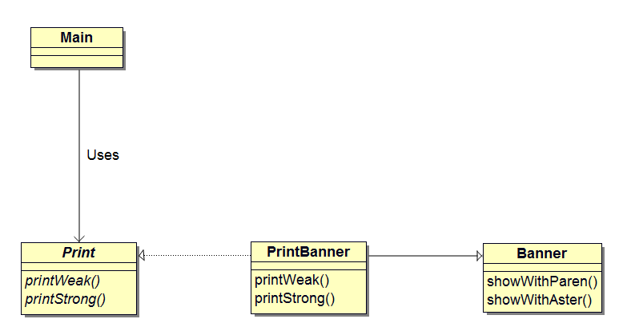
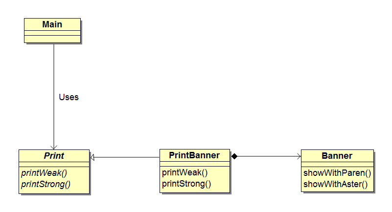
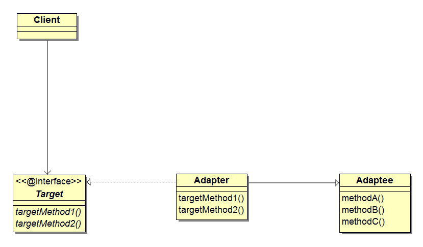
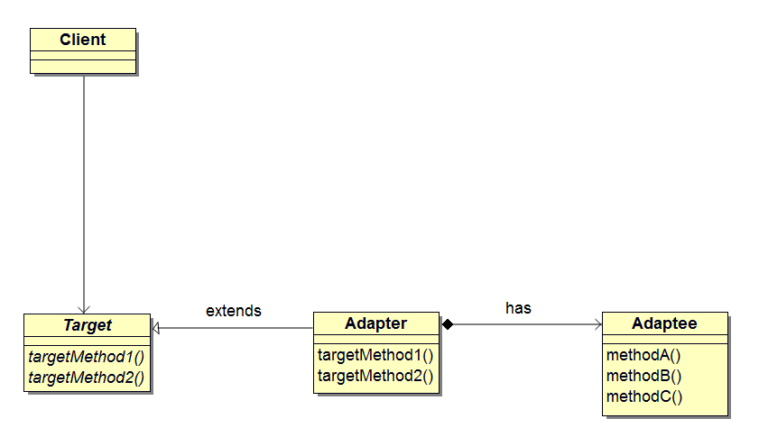

## 前言
如果想让额定工作电压是直流 12 伏特的笔记本电脑在交流 220 伏特的电源下工作，应该怎么做呢？通常我们会使用电源适配器（AC），将家庭用的交流 220 伏特电压转换成所需要的 12 伏特直流电压。这就是适配器的工作，它介于`实际情况`和`当前需求`之间，填补两者之间的差异。

## 适配器模式
在编程世界中，经常会存在现有的程序无法直接使用，需要做适当的改变之后才能使用的情况。这种用于填补`现有程序`和`所需程序`之间差异的设计模式就是适配器（Adapter）模式。适配器模式也称为 `Wrapper` 模式。Wrapper 有`包装器`的意思，替我们把某样东西包起来。适配器模式有以下两种。

- 类适配器模式（使用继承的适配器）；
- 对象适配器模式（使用委托的适配器）。

## 示例程序
下面是使用了适配器模式的示例程序。该示例程序会将输入的字符串分别显示为 （Hello） 和 \*Hello\*。

### 类适配器
下面是一段使用了`继承的适配器`的示例程序。

在已有的 Banner 类中，包含了将字符串用括号括起来的 showWithParen 方法，以及将字符串用星号括起来的 showWithAster 方法。Banner 类和上面已存在的`交流 220 伏特电压`类似。

假设 Print 接口中声明了两个方法，分别是弱化字符串显示（加括号）的 printWeak 方法，和强调字符串显示（加星号）的 printStrong 方法。Print 接口类似上文中`当前需求`的`直流 12 伏特电压`。

现在要做的事情是使用 Banner 类编写一个实现了 Print 接口的类，也就是要做一个将`交流 220 伏特电压`转换为`直流 12 伏特电压`的适配器。

扮演适配器角色的是 PrintBanner 类。该类继承了 Banner 类并实现了 Print 接口。PrintBanner 类使用 showWithParen 方法实现了 printWeak，使用 showWithAster 方法实现了 printStrong。这样，PrintBanner 类就具有适配器的功能了。电源比喻中的组件和示例程序中类或接口的对应关系如下。

-            | 电源比喻        | 示例程序
-------------|----------------|------------------------------------------
**实际情况**  |交流 220 伏特    |Banner 类（showWithParen、showWithAster）
**变换装置**  |适配器           |PrintBanner 类
**当前需求**  |直流 12 伏特     |Print 接口（printWeak、printStrong）

接下来是类适配器模式中的类和接口列表。

#### 类和接口列表

名称           | 描述
--------------|---------------------------------------------
Print         |表示`当前需求`的接口
PrintBanner   |表示适配器的类
Banner        |表示`实际情况`的类
Main          |测试程序行为的类

#### 类图
<center></center>

#### 代码
##### Banner 类
Banner 类表示现在的`实际情况`，提供现有的方法。
```java
public class Banner {
	private String string;

	public Banner(String string) {
		this.string = string;
	}

	public void showWithParen() {
		System.out.println("(" + string + ")");
	}

	public void showWithAster() {
		System.out.println("*" + string + "*");
	}
}
```

##### Print 接口
Print 声明了`当前需求`的接口。
```java
public interface Print {
	public abstract void printWeak();
	public abstract void printStrong();
}
```

##### PrintBanner 类
PrintBanner 类扮演适配器的角色。它继承了 Banner 类的 showWithParen 和 showWithAster 方法。同时，它又实现了 Print 接口的 printWeak 和 printStrong 方法。
```java
public class PrintBanner extends Banner implements Print {
	public PrintBanner(String string) {
		super(string);
	}

	public void printWeak() {
		showWithParen();
	}

	public void printStrong() {
		showWithAster();
	}
}
```

##### Main 类
Main 类作用是通过使用适配器来弱化或强调字符串显示。
```java
public class Main {
	public static void main(String[] args) {
		// 针对接口编程，而不是具体实现
		Print p = new PrintBanner("Java");
		p.printWeak();
		p.printStrong();
	}
}
```
在 Main 类中，我们使用 Print 接口来编程，而不是使用具体实现，这隐藏了 Banner 类及其实现的方法。这就好像笔记本电脑只需要在直流 12 伏特电压下工作，而不需要知道这 12 伏特的电压通过适配器将 220 伏特交流电转换而来的。

##### 运行结果
```bash
xbdong@ubuntu:~/Project/src/github/No.2_UMLAdapter$ sh build.sh
(Java)
*Java*
```

### 对象适配器
上面的示例程序展示了类适配器模式，下面是对象适配器模式。在类适配器模式中使用了`继承`实现适配，而这里我们需要使用`委托`来实现适配。在 Java 语言中，委托就是将方法中的具体处理交给其它实例的方式。下面是对象适配器的类列表。

#### 类列表

名称           | 描述
--------------|---------------------------------------------
Print         |表示`当前需求`的类
PrintBanner   |表示适配器的类
Banner        |表示`实际情况`的类
Main          |测试程序行为的类

Main 类和 Banner 类与类适配器模式中的内容完全相同，这里假设 Print 不是接口而是类。我们将 PrintBanner 声明为 Print 的子类。由于 Java 无法同时继承两个类，为了引用 Banner 类的方法，我们将它的的实例保存在 PrintBanner 类的字段中。

#### 类图
<center></center>

#### 代码
##### Print 类

```java
public abstract class Print {
	public abstract void printWeak();
	public abstract void printStrong();
}

```

##### PrintBanner 类
PrintBanner 类的 banner 字段保存了 Banner 类的实例，该实例是在 PrintBanner 类的构造函数中生成的。然后，printWeak 方法和 printStrong 方法会通过 banner 字段调用 Banner 类的 showWithParen 和 showWithAster 方法来实现。
```java
public class PrintBanner extends Print {
	private Banner banner;

	public PrintBanner(String string) {
		this.banner = new Banner(string);
	}

	public void printWeak() {
		banner.showWithParen();
	}

	public void printStrong() {
		banner.showWithAster();
	}
}

```
这就形成了一种委托关系。当 PrintBanner 类的 printWeak 被调用时，并不是 PrintBanner 类自己进行处理，而是将处理交给 Banner 类的实例。


## 模型和角色
读完示例程序后，下面我们分别看看类适配模式和对象适配模式的模型图。

**类适配模式**


**对象适配模式**


在 Adapter 模式中有以下角色。

### Target（目标需求）
该角色负责定义所需方法。以本文开头的例子来说，即让笔记本电脑正常工作的直流 12 伏特电源。在示例程序中，由 Print 接口（使用继承时）和 Print 类（使用委托时）扮演此角色。

### Adaptee（被适配）
Adaptee 类是一个持有既定方法的角色。以本文开头的例子来说，即交流 220 伏特电源。在示例程序中，由 Banner 类扮演此角色。

### Adapter（适配器）
Adapter 角色是适配器模式的核心。通过使用 Adaptee 角色的方法来满足 Target 角色的需求，这是 Adapter 角色的职责，也是 Adapter 模式的目的。以本文开头的例子来说，Adapter 角色就是将交流 220 伏特电压转换为直流 12 伏特直流电压的适配器。在示例程序中，由 PrintBanner 类扮演此角色。

### Client（请求者）
该角色通过使用 Target 角色定义的方法进行具体处理。以本文开头的例子来说，即直流 12 伏特电源所驱动的笔记本电脑。在示例程序中，由 Main 类扮演此角色。

在类适配器模式中，Adapter 角色通过继承来使用 Adaptee 角色。而在对象适配器模式中，Adapter 角色通过委托来使用 Adaptee 角色。

## 意义

- 将现有类作为组件重复利用；
- 在类适配器中，由于 Adapter 是 Adaptee 的子类，Adapter 可以重写 Adaptee 的方法；
- 在对象适配器中，一个 Adapter 可以适配多个 Adaptee。

## 参考

- Design Patterns : Elements of Reusable Object-Oriented Software
- 图解设计模式

