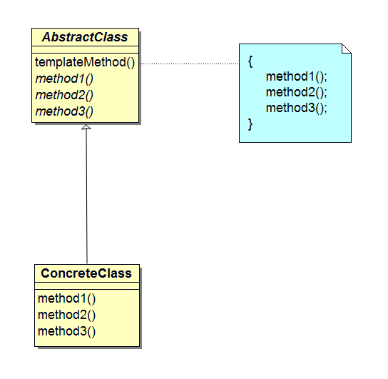

## 前言
在上文介绍的迭代器（Iterator）模式中使用了工厂（Factory）模式，而工厂模式中又使用了模板（Template Method）模式。这篇文章先介绍模板模式，下一篇文章将介绍工厂模式。

## 模板模式
每年的农历八月十五是中国传统节日中秋节，中秋节最大的习俗莫过于赏月吃月饼。如果尝试亲手做月饼，感觉一定非同寻常。通过使用模具，我们自己也可以做出好看的月饼。不同的馅可以做出不同味道的月饼，例如蛋黄、豆沙，还有莲蓉等。如果使用下面的模具，不管使用什么馅，做出月饼的形状和大小都一致，不同的只是它们的味道。

<center></center>

本文介绍的模板模式是带有模板功能的模式，这里的模板和做月饼使用的模具功能类似。模板方法中的抽象方法在父类中声明，在子类中实现。不同的子类实现的具体处理不同，当父类的模板方法被调用时程序的行为也不同。但是，不管子类中的具体处理如何实现，处理流程都会按照父类中所定义的那样执行。这种在父类中定义处理流程，在子类中实现具体处理的模式称为模板（Template Method）模式。

## 示例程序
下面是一段使用 Template Method 模式的示例程序。它将字符和字符串分别循环显示 5 次。示例程序中包含下面列表的 4 个类。

### 类列表

名称             | 描述
----------------|---------------
AbstractDisplay |只实现了 display 方法的抽象类
CharDisplay     |实现了 open、print、close 方法的类
StringDisplay   |实现了 open、print、close 方法的类
Main            |测试程序的行为的类

在 AbstractDisplay 类中定义了 display 方法，display 依次调用了 open、print 和 close 这 3 个方法。虽然这 3 个方法已经在 AbstractDisplay 中声明，但都是尚未实现的抽象方法。这里的 display 方法就是模板方法（Template Method）。open、print 和 close 这 3 个抽象方法在 AbstractDisplay 的子类 CharDisplay 和 StringDisplay 中实现。Main 类是用于测试应用程序行为的类。

### 类图

<center></center>

### 代码
#### AbstractDisplay 类
AbstractDisplay 类中包含了 4 个方法，分别是 display、open、print 和 close。其中只实现了 display 方法，其它三个都是抽象方法。在 display 中依次调用了 open、print 和 close 这 3 个抽象方法，它们由 AbstractDisplay 的子类来实现。
```java
public abstract class AbstractDisplay {
	public abstract void open();
	public abstract void print();
	public abstract void close();

	public final void display() {
		open();
		for (int i = 0; i < 5; i++) {
			print();
		}
		close();
	}
}
```
这里，将 display 定义为 final 方法可以防止它在子类中被重写。是否可以将 AbstractDisplay 声明为接口呢？如果将 AbstractDisplay 声明为接口，无法阻止已实现（default）的  display 方法会被子类重写。所以为了固定模板方法中的处理流程，最好使用抽象类。

#### CharDisplay 类
CharDisplay 是 AbstractDisplay  的子类，它实现了父类中的 3 个抽象方法——open、print 和 close。这 3 个方法的具体处理如下所示。

方法名    | 描述
---------|---------------------------
open     |显示字符串 “<<”
print    |显示构造函数接收的字符
close    |显示字符串 “>>”

相关代码如下。
```java
public class CharDisplay extends AbstractDisplay {
	private char ch;

	public CharDisplay(char ch) {
		this.ch = ch;
	}

	public void open() {
		System.out.print("<<");
	}

	public void print() {
		System.out.print(ch);
	}

	public void close() {
		System.out.println(">>");
	}
}
```
假设我们向 CharDisplay 的构造函数传递的参数是 `H` 这个字符，那么最终将会显示如下结果。
```bash
<<HHHHH>>
```

#### StringDisplay 类
和 CharDisplay 一样，它实现了 AbstractDisplay  类中的 open、print 和 close 抽象方法。这 3 个方法的处理如下所示。

方法名    | 描述
---------|--------------------------------------------
open     |显示字符串 “+-----+”
print    |在构造函数接收的字符串前后分别加上 “\|” 并显示出来
close    |显示字符串 “+-----+”

相关代码如下。
```java
public class StringDisplay extends AbstractDisplay {
	private String string;
	private int width;

	public StringDisplay(String string) {
		this.string = string;
		this.width = string.getBytes().length;
	}

	public void open() {
		printLine();
	}

	public void print() {
		System.out.println("|" + string + "|");
	}

	public void close() {
		printLine();
	}

	private void printLine() {
		System.out.print("+");
		for (int i = 0; i < width; i++) {
			System.out.print("-");
		}
		System.out.println("+");
	}
}
```
假如我们向 StringDisplay 的构造函数中传入的参数是 `Hello, world.` 这个字符串，那么最终会显示如下结果。
```bash
+-------------+
|Hello, world.|
|Hello, world.|
|Hello, world.|
|Hello, world.|
|Hello, world.|
+-------------+
```

#### Main 类
Main 类的作用是测试程序的行为。在该类中生成了 CharDisplay 和 StringDisplay 的实例，并分别调用 display 方法。
```java
public class Main {
	public static void main(String[] args) {
		AbstractDisplay d1 = new CharDisplay('H');
		AbstractDisplay d2 = new StringDisplay("Hello, world.");

		d1.display();
		d2.display();
	}
}
```

#### 运行结果
```bash
xbdong@ubuntu:~/Project/src/github/No.2_UMLTemplate$ sh build.sh
<<HHHHH>>

+-------------+
|Hello, world.|
|Hello, world.|
|Hello, world.|
|Hello, world.|
|Hello, world.|
+-------------+
```

### 时序图

<center></center>

## 模型和角色
读完示例程序后，下面我们看看 Template Method 模式的模型图。

<center></center>

接下来我们看看模型中规定的角色。

### AbstractClass（抽象类）
负责实现模板方法，还负责声明在模板方法中使用的抽象方法。这些抽象方法由子类 ConcreteClass 角色来实现。在示例程序中，
由 AbstractDisplay 类扮演此角色。

### ConcreteClass（具体类）
负责实现 AbstractClass 角色中声明的抽象方法。这里实现的方法将在 AbstractClass 角色的模板方法中被调用。在示例程序
中，由 CharDisplay 和 StringDisplay 扮演此角色。

## 意义

- Template Mothod 模式提取了不同类的公共行为，并在子类中实现具体行为。就像我们可以做出相同形状和大小的月饼，但它们的味道不同；
- 避免各子类间的代码出现重复。在父类的模板方法中实现了算法，无需在每个子类中再编写该算法；
- 确定处理流程，将具体的处理交给子类实现。