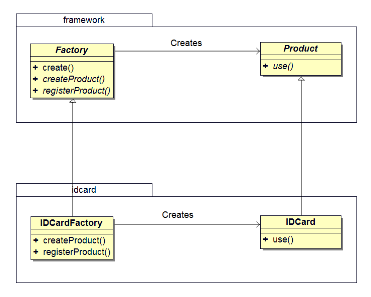
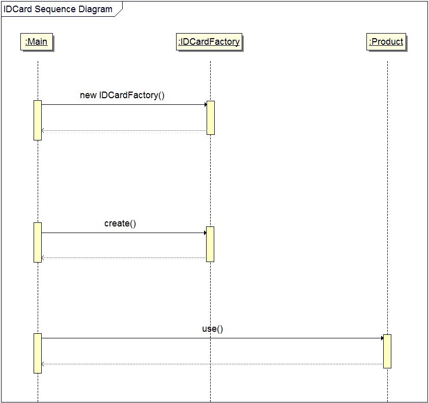
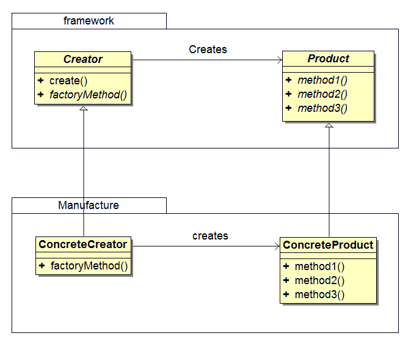

## 前言
在上一篇 Template Method 模式中，我们在父类中规定处理流程，然后在子类中实现具体的处理。如果将该模式用于生成实例，它就演变为本文将要介绍的 Factory Method 模式。

## 工厂模式
Factory 表示`工厂`的意思。通过使用 Template Method 模式来构建生成实例的工厂，这就是工厂（Factory Method）模式。

在工厂模式中，父类决定实例的生成方式，但并不决定所要实例化的类，具体的处理交给子类来实现。这样就可以将生成实例的框架（framework）和实际负责生成实例的类解耦。

## 示例程序
下面是一段使用了工厂模式的示例程序，这段示例程序的作用是制作身份证（ID 卡）。下面是相关类的列表。

### 类列表
包名        | 类名               | 描述
-----------|-------------------|--------------------------------------------------------------------
framework  |Product            |抽象类，声明了使用该产品的抽象方法  use
framework  |Factory            |抽象类，定义了 create 方法，并声明了 createProduct 抽象方法
idcard     |IDCard             |实现了 use 方法的类
idcard     |IDCardFactory      |实现了 createProduct、registerProduct 方法的类

createProduct 创建了实例，它被称作 Factory Method。

### 类图

<center></center>

### 代码
#### Product 类
framework 包中的 Product 类是用来表示`产品`的类。在该类中仅声明了 use 抽象方法，它提供了产品的使用接口。use 方法的实现由 Product 的子类来负责。
```java
package framework;

public abstract class Product {
	public abstract void use();
}
```

#### Factory 类
在 framework 包中的 Factory 类中使用了 Template Method 模式。该类声明了用于`生产产品`的 createProduct 抽象方法和用用于`注册产品`的 registerProduct 抽象方法。`生产产品`和`注册产品`的具体处理交给 Factory 类的子类负责。

在 framework 框架中，我们定义的工厂通过调用 create 方法生成 Product 实例。而 create 方法的实现是先调用 createProduct 生产产品，接着调用 registerProduct 注册产品。

具体实现因场景而异。Factory Method 方法通常在 Template Method 方法中调用。在上面的示例程序中，create 就是 Template Methods 方法。但 Factory Method 也可能单独使用，例如在 Iterator 模式中，使用 iterator 方法生成 Iterator 实例。
```java
package framework;

public abstract class Factory {
	public final Product create(String owner) {
		Product p = createProduct(owner);
		registerProduct(p);
		return p;
	}

	// 声明的抽象方法，需要子类实现
	protected abstract Product createProduct(String owner);
	protected abstract void registerProduct(Product product);
}
```

#### IDCard 类
IDCard 是 Product 的子类，用于表示身份证（ID 卡）的类。为了能够明显地体现出与框架的分离，我们将这个类放在 idcard 包中。
```java
package idcard;
import framework.*;

public class IDCard extends Product {
	private String owner;

	IDCard(String owner) {
		System.out.println("Making " + owner + "'s ID Card");
		this.owner = owner;
	}

	public void use() {
		System.out.println("Using " + owner + "'s ID Card");
	}

	public String getOwner() {
		return owner;
	}
}
```

#### IDCardFactory 类
IDCardFactory 类实现了 createProduct 和 registerProduct  方法。createProduct 方法通过生成 Product 的实例来 `生产产品`。registerProduct 方法通过将 IDCard 的 owner 字段（持有人）保存到 owners 字段中来 `注册产品`。
```java
package idcard;
import framework.*;
import java.util.*;

public class IDCardFactory extends Factory {
	private List<String> owners = new ArrayList<String>();

	protected Product createProduct(String owner) {
		return new IDCard(owner);
	}

	protected void registerProduct(Product product) {
		owners.add(((IDCard)product).getOwner());
	}

	public List getOwners() {
		return owners;
	}
}
```

#### Main 类
在 Main 类 中，通过导入 framework 包和 idcard 包来制作和使用 IDCard。
```java
import framework.*;
import idcard.*;

public class Main {
	public static void main(String[] args) {
		// 返回抽象类类型
		Factory factory = new IDCardFactory();

		// 调用子类的实现
		Product card1 = factory.create("XiaoMing");
		Product card2 = factory.create("XiaoHong");
		Product card3 = factory.create("XiaoGong");
		System.out.println();

		// 使用产品
		card1.use();
		card2.use();
		card3.use();
	}
}
```

#### 运行结果
```bash
xbdong@ubuntu:~/Project/src/github/No.4_UMLFactory$ sh build.sh
Making XiaoMing's ID Card
Making XiaoHong's ID Card
Making XiaoGong's ID Card

Using XiaoMing's ID Card
Using XiaoHong's ID Card
Using XiaoGong's ID Card
```

### 时序图

<center></center>

## 模型和角色

<center></center>

在 Factory Method 模式的角色中，父类（框架） 中的 Creator 角色和 Product 角色与子类（制造）中的 ConcreteCreator 角色和 ConcreateProduct 角色是平行关系。

### Product（产品）
Product 角色属于框架这一方。它是抽象类，声明产品的使用接口，具体的实现由子类 ConcreteProduct 决定。在示例程序中，由 Product 类扮演此角色。

### Creator（创建者）
Creator 角色属于框架这一方，它是负责生成 Product 实例的抽象类，但具体的处理由子类 ConcreteCreator 角色负责实现。在示例程序中，由 Factory 类扮演此角色。

### ConcreteProduct（具体的产品）
ConcreteCreator 角色属于制造这一方，它表示具体的产品。在示例程序中，由 IDCard 类扮演此角色。

### ConcreteCreator（具体的创建者）
ConcreteCreator 角色属于制造这一方，它负责生产具体的产品。在示例程序中，由 IDCardFactory 类扮演此角色。

## 意义

- 工厂模式将生成实例的框架（framework）和实际负责生成实例的类解耦；
- Framework 包不依赖于 idcard 包，使用相同的 Framework 框架还可以创建出其它不同的工厂和产品。

## 参考

- Design Patterns : Elements of Reusable Object-Oriented Software
- 图解设计模式
