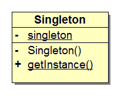
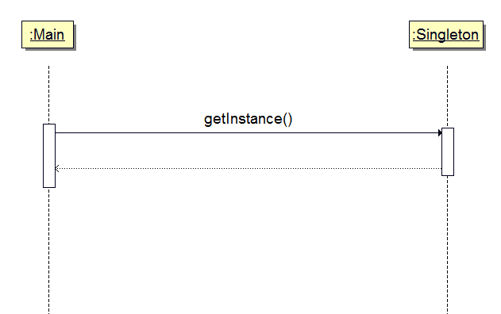

## 前言
程序运行时，一个类通常会生成多个实例。例如，表示字符串的`java.lang.String`类的实例与字符串是一对一的关系，当存在 100 个字符串时，会生成 100 个 String 类的实例。
但是，当我们想在程序中表示某个东西只会存在一个时，就会有`只创建一个实例`的需求。例如，表示程序运行的计算机的类、表示窗口系统的类，等等。

## 单例模式
在上述的程序中，如果某个类只存在一个实例，并确保在任何情况下都只会生成一个实例的模式被称作单例（Singleton）模式。单例模式可以防止多个实例之间相互影响、避免产生想不到的 BUG。

## 示例程序
下面是一段使用了单例模式的示例程序。该示例程序两次获取 Singleton 类的实例，并判断他们是否为同一个实例。下面是相关类的列表。

### 类列表

类名       | 描述
----------|---------------------
Singleton |只存在一个实例的类
Main      |测试程序行为的类

### 类图

<center></center>

上面是示例程序的类图。构造函数 Singleton 前面带有`-`符号，表示它使用 private 访问修饰符修饰，而`+`表示使用 public 访问修饰符修饰。此外，getInstance 方法带有下划线，表示该方法是 static 方法。static 方法独立于任何实例，它是属于类的方法。也就是说，类被加载到内存后，即使没有对象的情况下也能被正常调用。由于 static 方法属于类本身，因此不能像类的实例那样直接引用并操作类的字段，否则会出现编译错误。该类图使用 BoUML 工具绘制。

### 代码
#### Singleton 类
Singleton 类只会生成一个实例。它定义了 static 字段 singleton，并将其初始化为 Singleton 类的实例，初始化仅在该类被加载时执行一次。那么什么时候加载 Singleton 类呢？程序运行后，在第一次调用 getInstance 方法时 Singleton 类会被初始化，就在这时，static 字段 singleton 被初始化，生成唯一的实例。对于 static 字段，在内存中只有一份拷贝，JVM 只为它分配一次内存——在类的加载过程中完成内存分配。

Singleton 类的构造函数使用 private 修饰，这是为了禁止从 Singleton 类的外部调用构造函数，确保任何情况下都只能生成一个实例。如果从 Singleton 类以外的代码中调用构造函数（new Singleton()），就会出现编译错误。

在 Singleton 类中还定义了 getInstance 方法，以便程序从 Singleton 类外部获取它的唯一实例。
```java
public class Singleton {
	// 初始化行为仅在该类被加载时进行一次
	private static Singleton singleton = new Singleton();

	// 禁止从 Singleton 外部调用构造函数
	private Singleton() {
		System.out.println("Creating an instance.");
	}

	// 如果是 static 方法，可以直接使用类名字来调用
	public static Singleton getInstance() {
		return singleton;
	}
}
```

#### Main 类
Main 类使用了单例模式。在 Main 类中，两次调用了 Singleton 的 getInstance 方法来获取 Singleton 类的实例，并将返回值分别保存在 obj1 和 obj2 两个对象中。然后通过检查表达式`obj1 == obj2`是否成立来判断 obj1 和 obj2 是否为同一个实例。
```java
public class Main {
	public static void main(String[] args) {
		System.out.println("Start.");

		Singleton obj1 = Singleton.getInstance();
		Singleton obj2 = Singleton.getInstance();
		if (obj1 == obj2) {
			System.out.println("obj1 and obj2 are the same instance.");
		} else {
			System.out.println("obj1 and obj2 are the different instance.");
		}

		System.out.println("End.");
	}
}

```

#### 运行结果
下面是程序的运行结果。
```bash
xbdong@ubuntu:~/Project/src/github/No.5_UMLSingleton$ sh build.sh
Start.
Creating an instance.
obj1 and obj2 are the same instance.
End.
```

### 时序图
这里使用了 static 方法 getInstance 来获取类的实例，而不是通过 new 一个对象。

<center></center>

## 模型和角色
单例模式的模型图比较简单。

<center></center>

### Singleton
在单例模式中，只有 Singleton 一个角色。Singleton 角色中有一个返回唯一实例的 static 方法 getInstance，该方法总是返回同一个实例。

## 意义

－ 使用单例模式可以确保类只会生成一个实例，并提供 static 方法 getInstance 来获取这个唯一的实例；
－ 使用实例操作相对于使用类操作更加灵活，过多的类操作会导致面向对象编程退化为面向过程编程。在 C++ 语言中，子类还不能重写 static 方法（在 Java 语言中子类可以重写 static 方法，但重写后的方法也得是 static 方法才行）。

## 参考

- Design Patterns : Elements of Reusable Object-Oriented Software
- 图解设计模式