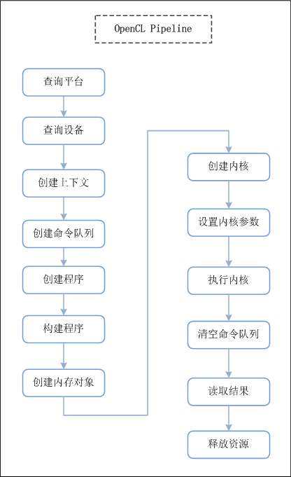

## 概述
该 OpenCL 程序在华为 Mate 8 上执行，输出内容如下

```bash
shell@HWFRD:/data/local/tmp $ ./hello_opencl
[Platform Infomation]
platform name: ARM Platform

[Device Infomation]
device name: Mali-T880

[Result]
lower case is: hello opencl, i like u
```

## 简介
使用 OpenCL 实现将大写字母转换为小写字母，然后输出。例如，输入字符串为`Hello OpenCL, I like U`，经转换后的输出是`hello opencl, i like u`。具体流程如下图所示：



## 实现
### 1.获取并选择一个将要运行的平台
平台包含了厂商对应的软、硬件环境，用户可以在上面运行自己开发的 OpenCL 程序。
OpenCL 支持跨平台，因此同一环境下可能同时存在多个平台，这时就需要获取当前环境下支持 OpenCL 的平台有哪些，并选择需要使用的进行后续初始化。
```c
err = clGetPlatformIDs(1, &platform, NULL);
```

### 2.获取执行 OpenCL 程序的设备
OpenCL 基于 C99 的扩展，它最终会被编译、链接。同一平台上可能包含多个可以执行 OpenCL 内核程序的设备，这些设备可以是 GPU 或者 CPU。在执行 OpenCL 内核之前，需要选择运行的设备。首先查看是否包含可用 GPU 设备，如果没有则选择 CPU。
```c
err = clGetDeviceIDs(platform, CL_DEVICE_TYPE_GPU, 1, &device, NULL);
if (err != CL_SUCCESS) {
        printf("can' get cpu device, try cpu...\n");
        err = clGetDeviceIDs(platform, CL_DEVICE_TYPE_CPU, 1, &device, NULL);
}
```

### 3.创建上下文
上下文用来管理不同的软硬件资源，这和操作系统中进程的概念有些类似，它包含了程序运行状态的资源。在 OpenCL 中，一个上下文只能对应到一个特定的平台，不同的平台需要创建自己的上下文。
```c
context = clCreateContext(NULL, 1, &device, NULL, NULL, &err);
if (context == NULL) {
        printf("create context fail\n");
        exit(EXIT_FAILURE);
}
```

### 4.创建命令队列
当设备执行任务时，由主机来提交命令，将命令发送到队列中。命令队列和设备对应，一个命令队列只能关联到一个设备，但
是单个设备可以有多个命令队列，这就可以将不同的命令提交到不同队列。
```c
queue = clCreateCommandQueue(context, device, 0, &err);
if (queue == NULL) {
        printf("create command queue fail\n");
        exit(EXIT_FAILURE);
}
```

### 5.创建程序
通过源代码创建程序对象，以供后续编译、链接。
```c
program = clCreateProgramWithSource(context, 1, &source, NULL, &err);
if (program == NULL) {
        printf("create program fail\n");
        exit(EXIT_FAILURE);
}
```

### 6.构建程序
程序对象经过编译、链接后，可以在指定的设备上运行，该过程实质调用了编译器和连接器。主机端的程序在运行之前需要构建，同理，设备端的内核程序也需在提交给设备运行之前构建。如果构建错误，则获取相关信息，以便进一步定位问题所在。
```c
err = clBuildProgram(program, 1, &device, NULL, NULL, NULL);
if (CL_SUCCESS != err) {
        size_t bufSize = 1024;
        char buf[bufSize];

        err = clGetProgramBuildInfo(program, device, CL_PROGRAM_BUILD_LOG,
                bufSize, buf, NULL);
        printf("build log:\n%s\n", buf);
        exit(EXIT_FAILURE);
}
```

### 7.创建内存对象
创建两个内存对象。输入内存对象引用的全局内存区域用来存放包含大写字母的字符串，经转换后小写字母存放到输出内存引用的内存区域。全局内存区域中的数据使用内存对象来表示，一个内存对象就是对全局内存区域的引用。
```c
input = clCreateBuffer(context, CL_MEM_READ_ONLY |
        CL_MEM_COPY_HOST_PTR, strlen(upper_case), upper_case, &err);
output = clCreateBuffer(context, CL_MEM_WRITE_ONLY, strlen(upper_case),
        NULL, &err);
if (input == NULL || output == NULL) {
        printf("create memory buffer fail: %d\n", err);
        exit(EXIT_FAILURE);
}
```

### 8.创建内核
内核是设备程序的入口，如图形处理器中的着色器程序。它类似于库文件中导出的库函数。设置执行的程序，以内核对象的方式提交到命令队列中。
```c
kernel = clCreateKernel(program, "toupper", &err);
if (kernel == NULL) {
        printf("create kernel fail: %d\n", err);
        exit(EXIT_FAILURE);
}
```

### 9.设置内核参数
给内核程序中的每个参数指定对应的值。
```c
err = clSetKernelArg(kernel, 0, sizeof(cl_mem), &input);
err |= clSetKernelArg(kernel, 1, sizeof(cl_mem), &output);
```

### 10.执行内核
将内核对象提交到命令队列中，供设备执行。
```c
err = clEnqueueNDRangeKernel(queue, kernel, 1,
                0, g_size, local_size,
                0, NULL, NULL);
```
参数 local_work_size 可以为 NULL。在这种情况下，由 OpenCL 的实现来决定如何把全局工作项划分为更小的工作组。

### 11.清空队列
避免获取的结果异常，等待直到命令队列中的命令在设备端执行完。
```c
clFinish(queue);
```

### 12.获取结果
获取设备端返回的结果

### 13.释放资源
在程序退出之前，释放前面创建的对象资源
```c
clReleaseKernel(kernel);
clReleaseMemObject(input);
clReleaseMemObject(output);
clReleaseProgram(program);
clReleaseCommandQueue(queue);
clReleaseContext(context);
```

## 内核
__kernel 代表这是一个内核函数。它包含两个参数，它们是指向全局内存区域的指针。in 指向的内存区域由 input 内存对象来引用，out 指向的内存区域由 output 内存对象来引用。每个工作项在全局范围内都有一个唯一的标识，通过该标识就可以将缓冲区中的每个元素和执行的内核实例关联。
```c
const char *source =
"__kernel void toupper(__global char *in, __global char *out)    \n"
"{                                                               \n"
"   int g_id = get_global_id(0);                                 \n"
"                                                                \n"
"   if ((in[g_id] >= 'A') && (in[g_id] <= 'Z'))                  \n"
"       out[g_id] = in[g_id] + 32;                               \n"
"   else                                                         \n"
"       out[g_id] = in[g_id];                                    \n"
"}                                                               \n";
```

## 小结
使用 clCreateXXXX 创建的对象，在程序退出前需要释放对应的资源。`EXIT_FAILURE` 在 `stdlib.h` 中定义，通常作为 `exit()` 函数参数来表明程序的运行结果。
