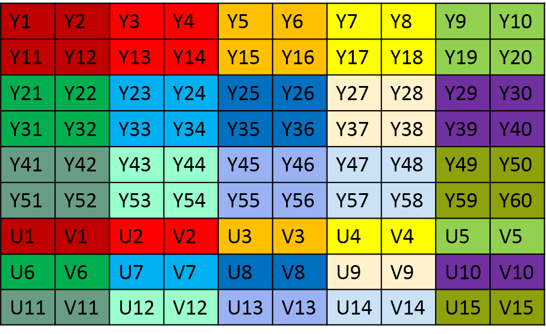
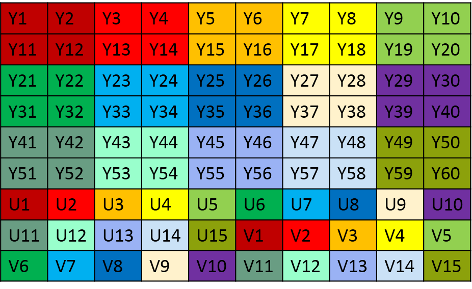
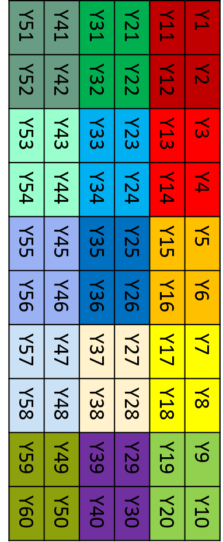
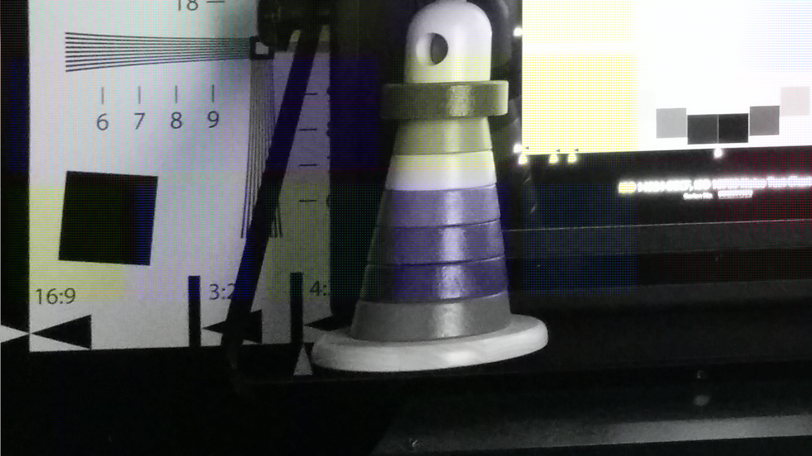
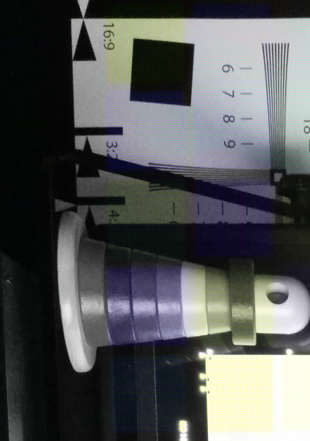

## 概述
分别在 CPU 上使用 C 语言和在 GPU 上使用 OpenCL 对一张 YUV420p 的图像顺时针旋转 90 度，比较两者之间的性能差异。GPU 使用了 Mali T-880 和 AMD RX 460 作对比。

## 简介
YUV 和我们熟知的 RGB 类似，是一种颜色编码格式。它主要用于电视系统和模拟视频邻域（如 Camera 系统）。YUV 包含三个分量，其中 `Y` 表示明亮度（Luminance 或 Luma），也就是灰度值。而 `U` 和 `V` 则表示色度（Chrominance 或 Chroma），作用是描述图像色彩及饱和度，用于指定像素的颜色。没有 UV 分量信息，一样可以显示完整的图像，只不过是黑白的灰度图像。YUV 格式的好处是很好地解决了彩色电视机与黑白电视机的兼容问题。而且 YUV 不像 RGB 那样要求三个独立的视频信号同时传输，所以用 YUV 方式传送占用极少的频宽。

YUV 格式包含两大类，分别为 planar 和 packed：
- 对于 planar 格式，先连续存储所有像素点的 Y 分量，紧接着存储所有像素点的 U 分量，最后是所有像素点的 V 分量；
- 对于 packed 格式，和 planar 格式一样，也是先连续存储所有像素点的 Y 分量，紧接着存储所有像素点的 UV 分量。不同的是，UV 分量是交替存放的。

在 YUV420 中，一个像素点对应一个 Y 分量，一个 2x2 的小方块对应一个 U 和 V，上面两种格式的 Y 值在排列是完全相同的（只有 Y 的图像就是灰度图像）。YUV420p 与 YUV420sp 的数据格式在 UV 的排列上不同，420p 它是先存放完 U 分量，再存放 V 放量，也就是说他们的 UV 分量是连续的。而 420sp 它的 UV 分量是按照 UV、UV…… 这样交替存放的。

假设原始图像的宽度和高度分别使用 w 和 h 表示，旋转前的图像尺寸是 w x h，旋转后的图像尺寸是 h x w，旋转前后图像大小保持不变。对于 YUV420p 数据格式，其数据在内存中安排如下：
- 图像占用的内存空间大小： w \* h * 3 / 2；
- Y 分量占用的内存大小为 w * h，从内存起始位置开始存放；
- Y 分量中每个 2x2 的小方块对应一个 U 和 V；
- U 分量大小为 (w/2)\*(h/2)，存放的位置从图像的 w * h 偏移位置开始；
- V 分量大小为 (w/2)\*(h/2)，存放的位置从图像的 w * h + (w * h)/4 偏移位置开始。

下面是 YUV420sp 和 YUV420s 图像格式在内存中的存储情况，这些数据在内存中是线性存储的。当使用图片浏览器显示的是时候需要指定它们的尺寸（宽度和高度），否则不能正确显示。例如，40x30 和 20x60 这两张图像的像素点的个数相同，但如果把 40x30 的图像按照 20x60 的图像来显示，就会出现显示异常。

**YUV420sp 格式**



**YUV420p 格式**



把 YUV420p 的图像顺时针旋转 90 度后，Y 分量在内存中存放如下图所示，随后是连续的 U 分量 和 V 分量。

**YUV420p 旋转 90 度**



旋转步骤如下，把图像看作是一个类似 `image[w][h]` 的二维数组。
- 先处理 Y 分量，原始图像的第一个像素位置为 (h-1)\*w，旋转后的目标位置为 (0, 0)；第二个像素位置为 (h-2)*w，旋转后的目标位置为 (0, 1)，以此类推；
- 接下来处理 U 分量，U 和 V 分量的大小都为 (w/2)\*(h/2)。原图的第一个像素位置为 (w\*h)+(((h/2)-1)\*(w/2))，旋转后的目标位置为(w\*h)+(0, 0)；第二个像素位置为 (w\*h)+(((h/2)-2)\*(w/2))，旋转后的目标位置为 (w\*h)+(0, 1)，以此类推；
- 最后处理 V 分量。原图的第一个像素位置为 (w\*h)+(w\*h/4)+(((h/2)-1)\*(w/2))，旋转后的目标位置为 (w\*h)+(w\*h/4)+(0, 0)；第二个像素位置为 (w\*h)+(w\*h/4)+(((h/2)-2)\*(w/2))，旋转后的目标位置为 (w\*h)+(w\*h/4)+(0, 1)，以此类推。

## 实现
函数 yuv420p_rotate_normal 是 C 语言实现。该函数接收图像的宽度和高度，将 YUV420p 图像顺时针旋转 90 度。在处理器执行算数运算时，除法往往需要多个 CPU 周期才能完成，而加法和移位等操作能在单个 CPU 周期内完成，为了提升除发运算的执行效率，在 yuv420p_rotate_shift 函数中使用移位操作来替代 yuv420p_rotate_normal 中的除法运算。

### 1.算法实现
采用 C 语言的算法实现如下：
```c
/**
 * 使用 C 语言在 CPU 上执行旋转操作。
 */
void yuv420p_rotate_normal(uint8_t *src, uint8_t *des, int w, int h)
{
	int i, j;
	int wh = w * h;

	// 旋转 Y 分量，按照列对原始图像取值
	int k = 0;
	for(i = 0; i < w; i++) {
		for(j = h-1; j >= 0; j--) {
			des[k] = src[w*j + i];
			k++;
		}
	}

	// 旋转 U 分量
	for (i = 0; i < w/2; i++) {
		for (j = 1; j <= h/2; j++) {
			des[k] = src[wh + ((h/2 - j) * (w/2) + i)];
			k++;
		}
	}

	// 旋转 Ｖ 分量
	for (i = 0; i < w/2; i++) {
		for (j = 1; j <= h/2; j++) {
			des[k] = src[wh+wh/4 + ((h/2 - j) * (w/2) + i)];
			k++;
		}
	}
}
```

### 2.显示
图像 `ghost_yuv420p_1280x720.yuv` 旋转前、后的显示效果如下图所示，原始图像是从 `ghost_yuv420p_3264x2448.yuv` 左下角截取的矩形区域，相关算法参见示例 [No.1_YUV420pScissor](../tools/No.1_YUV420pScissor/YUV420pScissor.md)，它可以从一幅较大 YUV420p 图像的左上角或左下角截取一块矩形区域。

**原始图像**



**旋转后图像**



### 3.性能
使用 GPU 和 CPU 实现旋转算法，对 `ghost_yuv420p_3264x2448.yuv` 图像旋转，分别在华为荣耀8的 Mali T-880 平台和 Ubuntu 的 AMD RX 460 平台上执行 GPU 运算，ubuntu 对应的 CPU 为 i5-4590，时间统计如下：

**ARM T-880**

```bash
shell@HWFRD:/data/local/tmp $ ./opencl_rotate
Test: yuv420p_rotate_opencl, 62.497917 ms
Test: yuv420p_rotate_normal, 100.525000 ms
```
从上面统计的时间来看，在 T-880 GPU 上运行的时间和 ARM CPU 比较，性能提升了大约 60%；

**AMD RX 460**

```bash
xbdong@xbdong-opencl:~/Project/github/OpenCL/No.5_2_OpenCLRotate$ ./OpenCLRotate
Test: yuv420p_rotate_opencl, 13.518628 ms
Test: yuv420p_rotate_normal, 38.027586 ms
```
在 AMD RX 460 上使用 GPU 和 CPU 相比，性能提升了 180%，这进一步体现了 GPU 在通用计算的优势。

> 只有在需要处理大量运算的情况下才能体现 GPU 的优势。如果对 1280x720 的图像旋转来处理少量的数据，这样 OpenCL 函数调用，设备间通信等操作会把 GPU 带来的好处给抵消。

通过上面的实验，对 CPU 和 GPU 执行同样的算法在性能上有个大概的认识，实际性能和频率、算法的优化等相关。

## 参考
- http://stackoverflow.com/questions/3138090/how-to-rotate-yuv420-data/10004761#10004761
- http://www.cnblogs.com/azraelly/archive/2013/01/01/2841269.htm


