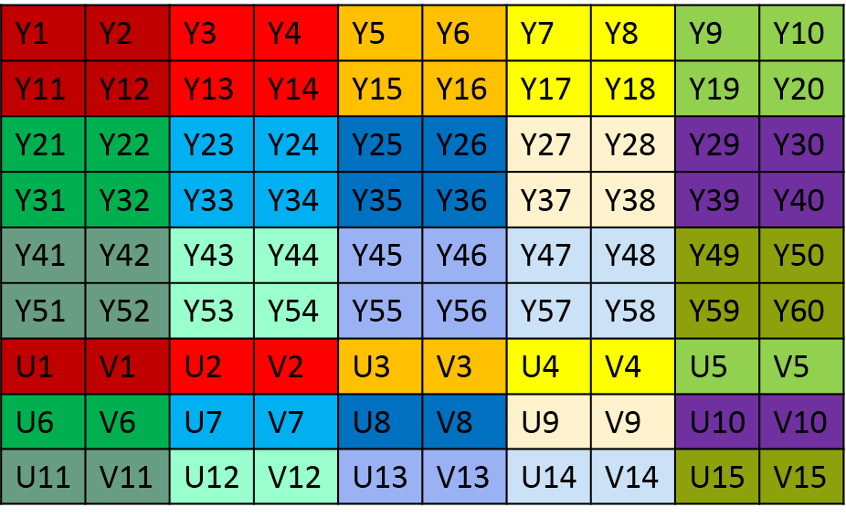
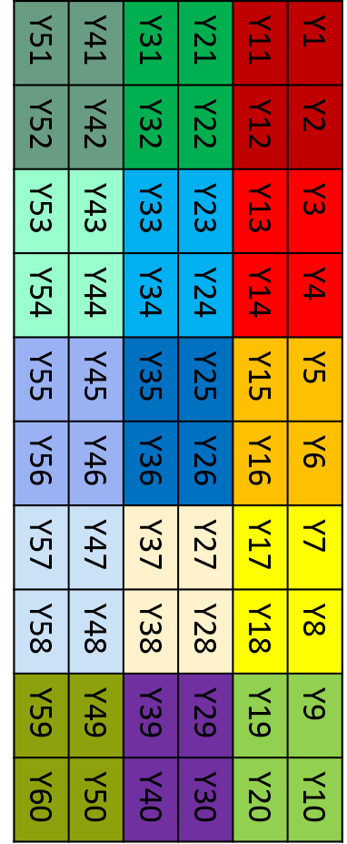

## 概述
分别在 CPU 上使用 C 语言和在 GPU 上使用 OpenCL 对一张 YUV420p 的图像顺时针旋转 90 度，比较两者之间的性能差异。GPU 使用了 Mali T-880 和 AMD RX 460 作对比。输出结果如下：

```bash
xxxx xxx
```

## 简介
YUV 和我们熟知的 RGB 类似，是一种颜色编码格式。它主要用于电视系统和模拟视频邻域（如 Camera 系统）。YUV 包含三个分量，其中 `Y` 表示明亮度（Luminance 或 Luma），也就是灰度值。而 `U` 和 `V` 则表示色度（Chrominance 或 Chroma），作用是描述图像色彩及饱和度，用于指定像素的颜色。没有 UV 分量信息，一样可以显示完整的图像，只不过是黑白的灰度图像。YUV 格式的好处是很好地解决了彩色电视机与黑白电视机的兼容问题。而且 YUV 不像 RGB 那样要求三个独立的视频信号同时传输，所以用 YUV 方式传送占用极少的频宽。

YUV 格式包含两大类，分别为 planar 和 packed：
- 对于 planar 格式，先连续存储所有像素点的 Y 分量，紧接着存储所有像素点的 U 分量，最后是所有像素点的 V 分量；
- 对于 packed 格式，和 planar 格式一样，也是先连续存储所有像素点的 Y 分量，紧接着存储所有像素点的 UV 分量。不同的是，UV 分量是交替存放的。

在 YUV420 中，一个像素点对应一个 Y 分量，一个 2x2 的小方块对应一个 U 和 V，上面两种格式的 Y 值在排列是完全相同的（只有 Y 的图像就是灰度图像）。YUV420p 与 YUV420sp 的数据格式在 UV 的排列上不同，420p 它是先存放完 U 分量，再存放 V 放量，也就是说他们的 UV 分量是连续的。而 420sp 它的 UV 分量是按照 UV、UV…… 这样交替存放的。

假设原始图像的宽度和高度分别使用 w 和 h 表示，旋转前的图像尺寸是 w x h，旋转后的图像尺寸是 h x w，旋转前后图像大小保持不变：
- 图像占用的内存空间大小： w \* h * 3 / 2；
- Y 分量占用的内存大小为 w * h，从内存起始位置开始存放；
- Y 分量中每个 2x2 的小方块对应一个 U 和 V；
- U 分量大小为 (w/2)\*(h/2)，存放的位置从图像的 w * h 偏移位置开始；
- V 分量大小为 (w/2)\*(h/2)，存放的位置从图像的 w * h + (w * h)/4 偏移位置开始。

下面是 YUV420sp 和 YUV420s 图像格式在内存中的存储情况，这些数据在内存中是线性存储的。当使用图片浏览器显示的是时候需要指定它们的尺寸（宽度和高度），否则不能正确显示。例如，40x30 和 20x60 这两张图像的像素点的个数相同，但如果把 40x30 的图像按照 20x60 的图像来显示，就会出现显示异常。

** YUV420sp 格式**

**YUV420p 格式**


把 YUV420p 的图像顺时针旋转 90 度后，Y 分量在内存中存放如下图所示，随后是连续的 U 分量 和 V 分量。

**YUV420p 旋转 90 度**


旋转步骤如下，把图像看作是一个类似 `image[w][h]` 的二维数组。
- 先处理 Y 分量，原始图像的第一个像素位置为 (h-1)\*w，旋转后的目标位置为 (0, 0)；第二个像素位置为 (h-2)*w，旋转后的目标位置为 (0, 1)，以此类推；
- 接下来处理 U 分量，U 和 V 分量的大小都为 (w/2)\*(h/2)。原图的第一个像素位置为 (w\*h)+(((h/2)-1)\*(w/2))，旋转后的目标位置为(w\*h)+(0, 0)；第二个像素位置为 (w\*h)+(((h/2)-2)\*(w/2))，旋转后的目标位置为 (w\*h)+(0, 1)，以此类推；
- 最后处理 V 分量。原图的第一个像素位置为 (w\*h)+(w\*h/4)+(((h/2)-1)\*(w/2))，旋转后的目标位置为 (w\*h)+(w\*h/4)+(0, 0)；第二个像素位置为 (w\*h)+(w\*h/4)+(((h/2)-2)\*(w/2))，旋转后的目标位置为 (w\*h)+(w\*h/4)+(0, 1)，以此类推。

## 实现
### 1.创建头文件
新建 `lower.cl` 文件，在该文件中添加 `lower` 函数，该函数实现将大写字母转换为小写字母。
```c
char lower(char val)
{
	return val+32;
}
```

### 2.头文件程序对象
创建头文件对应的程序对象，在编译时使用。
```c
cl_program header_program;

/* header program */
program_buf = package_program("lower.cl");
if (!program_buf) {
	printf("alloc program buffer fail:lower.cl\n");
	exit(EXIT_FAILURE);
}

// create program
header_program = clCreateProgramWithSource(context, 1, (const char **)&program_buf, NULL, &err);
if (header_program == NULL) {
	printf("create header program fail\n");
	exit(EXIT_FAILURE);
}
free(program_buf);
```

### 3.编译

```c
err = clCompileProgram(program, 1, &device, NULL,
	1, &header_program, &header_name, NULL, NULL);
```
相关参数在 `No.4_1_OpenCLCompile` 中描述，这里不在赘述。编译后的程序对象 `program` 在链接时使用。由于在链接时，只有一个程序对象输入，这和 `No.4_1_OpenCLCompile` 中一样，故无需对 `clLinkProgram` 的函数参数进行修改。


