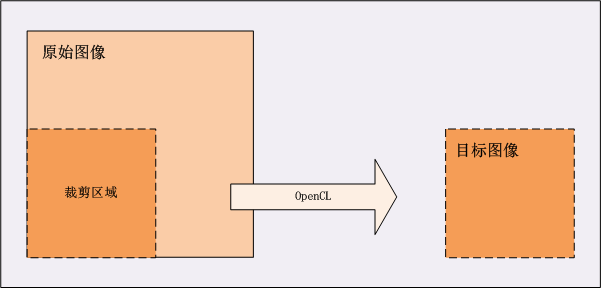

## 简介
在 OpenCL 1.1 中，已经支持对图像的读写。本文描述如何通过 OpenCL API 调用，从一张较大的图像中截取一块矩形区域，供图片浏览器显示。该程序实现的功能和 [No.1_YUV420pScissor](../tools/No.1_YUV420pScissor/YUV420pScissor.md) 类似，不同的是 No.1_YUV420pScissor 中直接对像素数据进行处理，而该程序中通过 OpenCL 内置图像读写函数来对像素数据进行采样。

## 实现
该程序接收 [No.2_2_FreeImage](../tools/No.2_2_FreeImage/FreeImage.md)  中由函数 `load_image` 保存的二进制图像数据，然后通过 OpenCL 来提取其中的部分矩形区域，将该矩形区域保存为二进制图像文件。最后将提取的矩形区域像素使用 No.2_2_FreeImage 中 `store_image` 函数保存为位图文件，供图片浏览器查看。具体执行流程可参考 [No.2_2_FreeImage](../tools/No.2_2_FreeImage/FreeImage.md)。



由于截取的矩形区域图像为 256x256，在保存位图文件时需要更新图像格式和尺寸，需要对程序 No.2_2_FreeImage 中对应参数作相关调整，打上如下 patch，内容如下：
```bash
+FREE_IMAGE_FORMAT g_format = (FREE_IMAGE_FORMAT)13;
+int g_width = 256, g_height = 256;
```

### 1.创建图像对象
缓冲区对象和图像对象都是内存对象，内存对象是对全局内存区域的引用。不同的是图像对象除了像素数据，还包含了对图像格式及图像属性的描述信息，例如图像宽度、高度，以及深度等。

创建了两个图像对象，分别用来存放原始图像数据和目标图像数据。图像对象和缓冲区对象类似，都是 cl_mem 类型。
```c
cl_image_format image_format;
cl_mem in_buffer, out_buffer;

memset((void *)&image_format, 0, sizeof(cl_image_format));
image_format.image_channel_order = CL_RGBA;
image_format.image_channel_data_type = CL_UNORM_INT8;

in_buffer = clCreateImage2D(context,
                CL_MEM_READ_ONLY | CL_MEM_USE_HOST_PTR, &image_format,
                orig_width, orig_height, 0, src, &err);

out_buffer = clCreateImage2D(context, CL_MEM_WRITE_ONLY, &image_format,
                new_width, new_height, 0, NULL, &err);
```
其中 cl_image_format 用来定义图像的格式，成员如下：
- image_channel_order：指定每个像素的通道数目和通道布局；
- image_channel_data_type：描述每个通道的大小，表示的数据类型。

该程序在华为`荣耀8`上运行。由于`荣耀8`只支持 OpenCL 1.1，该版本创建图像对象对应的函数是 clCreateImage2D，如本文所示。在 OpenCL 1.2 中将函数 clCreateImage2D 和 clCreateImage3D 合并到了 clCreateImage，同时增加了 cl_image_desc 参数，用来描述图像的属性，包含图像类型、宽度、高度和深度等信息。

### 2.图像读写
图像读写操作通过 OpenCL 内置的图像读写函数 `read_imageX` 和 `write_imageX` 来执行，图像读写函数只能作用于图像对象。在主机端，图像对象使用 `clSetKernelArg` 传递给内核程序。内核代码如下：
```c
__constant  sampler_t sampler = CLK_NORMALIZED_COORDS_FALSE |
	CLK_FILTER_NEAREST | CLK_ADDRESS_CLAMP;

__kernel void rotate_rgba(__read_only image2d_t srcImg,
	__write_only image2d_t dstImg)
{
	const int x = get_global_id(0);
	const int y = get_global_id(1);

	// 根据旋转后坐标读取元素图像元素值
	float4 value = read_imagef(srcImg, sampler, (int2)(x, y));
	write_imagef(dstImg, (int2)(x, y), value);
}
```
#### 2.1采样器
采样器对象描述了读取图像数据时如何对图像进行采样。图像读取函数 `read_imageX` 包含一个采样器参数，该参数可以在主机端通过调用 OpenCL API 函数创建，然后使用 `clSetKernelArg` 传递给内核；也可以在内核程序中声明，在内核程序中声明的采样器对象为 `sampler_t` 类型的常量。采样器对象包含了一些属性，这些属性描述了在读取图像对象的像素时如何采样。分别是规格化浮点坐标，寻址模式和过滤模式。

- 规格化坐标：指定传递的 x、y 和 z 坐标值是规格化浮点坐标还是非规格化坐标值。可以是 `CLK_NORMALIZED_COORDS_TRUE` 或者 `CLK_NORMALIZED_COORDS_FALSE` 枚举类型的值；
- 寻址模式：指定图像的寻址模式。即，当传递的坐标值超过图像坐标区域时该如何处理。可以是下面的枚举类型的值：
CLK_ADDRESS_MIRRORED_REPEAT：图像区域外的坐标设置为区域内坐标的反射值对应的颜色；
CLK_ADDRESS_REPEAT：图像区域外的坐标重复区域内坐标的颜色，只对规格化坐标有效；
CLK_ADDRESS_CLAMP_TO_EDGE：图像区域外的坐标返回图像边缘的颜色；
CLK_ADDRESS_CLAMP：图像区域外坐标返回的颜色和边框颜色保持一致；
- 过滤模式：指定使用的过滤模式。可以是 `CLK_FILTER_NEAREST` 或 `CLK_FILTER_LINEAR` 枚举类型值，分别表示最近邻插值和双线性插值。

##### 边框的颜色
当采样器的寻址模式设置为 `CLK_ADDRESS_CLAMP` 时，超过图像区域的坐标返回边框的颜色。边框颜色的选择依赖图像颜色通道，如下：

- 如果图像颜色通道是 CL_A，CL_INTENSITY，CL_Rx，CL_RA，CL_RGx，CL_RGBx，CL_ARGB，CL_BGRA 或 CL_RGBA，边框颜色为 （0.0f，0.0f， 0.0f，0.0f）；
- 如果图像颜色的通道是 CL_R，CL_RG，CL_RGB 或 CL_LUMINANCE，边框颜色为（0.0f，0.0f，0.0f，1.0f）。

CL_RGBA 的颜色通道中，如果是全 0 则表示黑色，全 0xFF 表示白色。Alpha 通道如果是 1，则不透明，如果是 0 则全透明。

#### 2.2坐标
在图像读写函数 `read_imageX` 和 `write_imageX`  中，对于 2D 图像对象，传递的 x 坐标范围是 `[0, width-1]`，y 坐标范围是 `[0, height-1]`，坐标原点 `[0, 0]` 对应图像的左下角。

#### 2.3读写操作
对于不同的图像对象，函数 `read_imageX` 返回由四个通道组成的颜色值，使用 x、 y、 z 和 w 来表示。x 表示红色，y 表示绿色，z 表示蓝色，w 表示 alpha 通道。函数 `write_imageX` 将四个通道表示的颜色值写入图像对象指定的坐标位置。图像数据类型 `image2d_t`，表示 2D 图像，需要使用如下的限定符来修饰：
- 对于内核执行`读`操作的图像对象，在声明的时候需要使用 `__read_only` 限定符修饰；
- 对于内核执行`写`操作的图像对象，在声明的时候需要使用 `__write_only` 限定符修饰；
- 同一个图像对象不能同时支持`读写`操作，限定符使用不当将引发编译错误。

### 3.读取图像数据
把命令添加到命令队列中，将图像对象指定区域的数据读取到主机内存，以供图片浏览器查看。该区域是一个矩形区域。
```c
size_t origin[3] = {0 , 0, 0};
size_t region[3] = {new_width, new_height, 1};
err = clEnqueueReadImage(queue, out_buffer, CL_TRUE, origin, region, 0,
        0, des, 0, NULL, NULL);
```
部分参数说明如下：
- origin：图像中的偏移（x，y，z），以像素为单位的。如果 `image` 是 2D 图像对象，origin[2] 必须为 0；
- region：定义 1D，2D 或 3D 图像的矩形区域，属性为（width，height，depth）。如果 image 是 2D 图像对象， region[2] 必须是 1。

## 结果
该程序运行后，经过 `No.2_2_FreeImage` 处理显示效果如下图所示。

**原始图像**


**目标图像**


## 参考

- https://streamcomputing.eu/blog/2011-11-19/difference-between-opencl-1-2-and-1-1/

