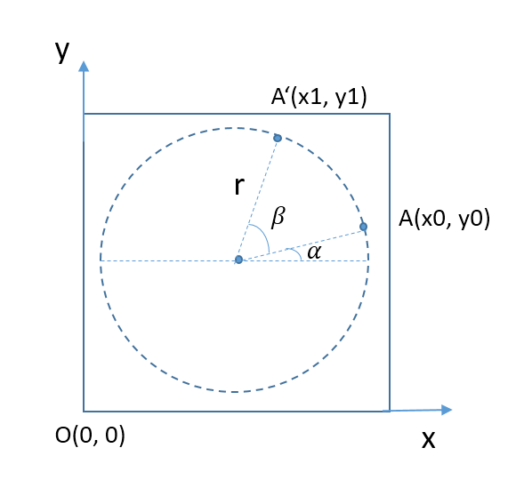
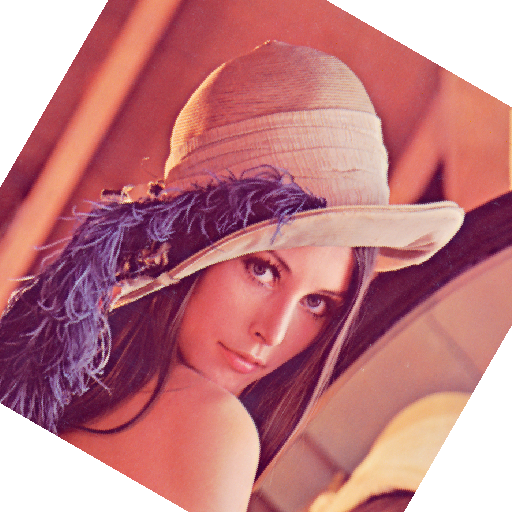

## 简介
该程序对图像旋转一定的角度，角度大小可通过调节参数来控制。其实现方式和 [No.6_1_OpenCLSampler](../No.6_1_OpenCLSampler/OpenCLSampler.md) 类似，都使用了 OpenCL 内置的采样器对象来访问图像数据。

要想旋转整个图像，我们需要对图像中的每个像素点执行旋转操作，这需要知道像素点的原始位置和旋转后的目标位置。本文描述如何对 2D 图像进行旋转，在执行内核函数时，将工作项的维度设置为 2，两个维度分别对应图像的宽度和高度，这样在内核执行时就能对所有的像素点执行旋转操作。

## 实现
其实现和 `No.6_1_OpenCLSampler` 基本类似，都在`荣耀8`上运行，不再赘述。这里着重描述内核代码的功能该如何实现。

将图像上的每个点看作是在以圆心为原点的圆上，圆心位置在图像的中心。如下图所示：



假设半径为 `𝑟` ，将点 `A(x0, y0)` 旋转 `𝛽` 后，点 `A′` 的坐标为 `(x1, y1)`。通过点 `A` 来计算 `A′`，三角函数展开如下：


由于，


将 `x0` 和 `y0` 带入得，


在三角函数计算中，函数 `sin` 和 `cos` 传入的参数以`弧度（radians）`为单位。假设 `n` 为旋转圆心角度数，则对应的弧度 `𝛼` 表示为，


> `弧度`和`度`是度量角大小的两种不同单位，在三角函数里以`弧度`为单位。弧度的定义为，当弧长正好等于圆的半径时，夹角的大小为 1 弧度，360 度角对应的弧长为 `2𝜋r`，所以弧度为 `2𝜋`；因此，180 度角对应的弧度为 `𝜋`。

OpenCL 内置的图像读写函数 `read_imageX` 和 `write_imageX` 中，传入坐标参数的坐标原点 `O` 在图象的左下角。在做旋转操作前，先把图像坐标 `(x, y)` 转换为相对于圆心坐标的点，旋转后再还原为图像读写函数使用的坐标。内核代码如下：
```c
__constant  sampler_t sampler = CLK_NORMALIZED_COORDS_FALSE |
	CLK_FILTER_NEAREST | CLK_ADDRESS_CLAMP;

__kernel void rotate_rgba(__read_only image2d_t srcImg,
	__write_only image2d_t dstImg,
	float angle)
{
	int width = get_image_width(srcImg);
	int height = get_image_height(srcImg);
	const int x = get_global_id(0);
	const int y = get_global_id(1);
	float sinma = sin(angle);
	float cosma = cos(angle);

	// 计算旋转点中心
	int ox = width / 2;
	int oy = height / 2;

	// 相对于圆心的点，临时变量（将圆心看作坐标原点）
	int xt = x - ox;
	int yt = y - oy;

	// 计算旋转后坐标。y 是右上方上面的点（顺时针旋转）
	float2 readCoord;
	readCoord.x = (cosma * xt - sinma * yt) + ox;
	readCoord.y = (sinma * xt + cosma * yt) + oy;

	// 根据旋转后坐标读取元素图像元素值
	float4 value = read_imagef(srcImg, sampler, readCoord);
	write_imagef(dstImg, (int2)(x, y), value);
}
```
采样器的寻址模式为 `CLK_ADDRESS_CLAMP`，超过图像区域的坐标返回边框的颜色。由于图像的颜色通道是 CL_RGBA，对应的边框颜色为 （0.0f，0.0f， 0.0f，0.0f），它的 Alpha 通道为 0，表示全透明。当像素点的 Alpha 通道为全透明时，则什么也看不见。

## 结果
该程序运行后，经过 `No.2_2_FreeImage` 处理显示效果如下图所示。

**原始图像**


**旋转后图像**



### 旋转方向
如果是从 A' 采样，写到 A，则是顺时针旋转。`旋转后图像`的四个角中，由于`原始图像`的采样点在图像区域的外面，所以是边框的颜色。在 [No.6_3_OpenCLSampler](../No.6_3_OpenCLSampler/OpenCLSampler.md) 中，采样的时候，如果采样点在图像区域外面，把获取的像素点设置为黑色。

## 参考
- http://blog.csdn.net/hongxiali/article/details/5355954


