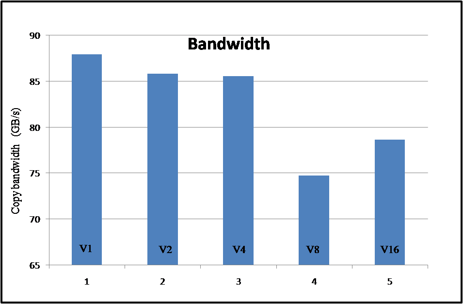

# OpenCL 性能分析
## 测量时间
### 时钟和时间

在`OpenCL 编程实践`前面的文章中，为了比较 CPU 和 GPU 的性能，在统计函数的执行时间时使用了 `glibc` 中提供的时钟和时间相关函数。为了测得 `func` 函数的执行时间，在待测函数执行前，首先通过调用 system_time() 得到当前的时间戳 `time_start`，接着执行 `func` 函数，待其执行完后再次调用 system_time() 得到当前时间戳 `time_end`，使用 time_end 减去 time_start 就可以得到函数 `func` 的执行时间。下面是封装后的 system_time() 函数：
```c
int64_t system_time()
{
	struct timespec t;

	clock_gettime(CLOCK_MONOTONIC, &t);
	return (int64_t)(t.tv_sec) * 1e9 + t.tv_nsec;
}
```

函数 clock_gettime() 的原型如下：
```c
int clock_gettime(clockid_t clk_id, struct timespec *tp);

struct timespec {
	time_t   tv_sec;        /* seconds */
	long     tv_nsec;       /* nanoseconds */
};
```

参数描述：

- clk_id：表示时钟类型。CLOCK_MONOTONIC 为单调递增时钟，在系统启动后开始计时，其时间不能手动的被重新设置。在 Linux 内核中，CLOCK_MONOTONIC 时钟通过高精度定时器实现，使用 hrtimer_init() 来初始化；
- tp：指向结构体 timespec 的指针，返回当前的时间戳信息。

在 Linux 系统中，内核版本从 `Linux 2.6.28 开始`，增加了对 CLOCK_BOOTTIME 时钟的支持。该时钟和 CLOCK_MONOTONIC 比较类似，但是它包含了系统在休眠过程中的时间，这在记录的时间戳信息需要包含休眠时间时非常有用。关于时钟的精度可通过调用 clock_getres() 函数来获取，其原型如下：
```c
int clock_getres(clockid_t clk_id, struct timespec *res);
```
下面是参数描述：

- clk_id：表示对应时钟的类型；
- res：返回该时钟的精度，以纳秒为单位。

在下面的示例代码中，为了更准确的计算函数 `clEnqueueNDRangeKernel` 的执行时间，在其前后分别调用了 clFinish() 函数。在 clEnqueueNDRangeKernel() 的前面调用 clFinish() 函数，可以避免在执行 clEnqueueNDRangeKernel 函数时，已提交到命令队列中的其它命令对它产生影响。通过添加 clFinish() 函数能保证在执行 clEnqueueNDRangeKernel() 函数之前，提交到命令队列的其它命令已经执行完成；在 clEnqueueNDRangeKernel() 之后又再次调用了 clFinish() 函数，这是由于 `clEnqueueNDRangeKernel` 是异步执行，在函数返回时，该函数并没有执行完成。通过添加 clFinish() 函数就可以让当前的 CPU 进入阻塞状态，直到命令队列中的命令执行完成之后才返回。
```c
clFinish(queue);
int64_t time_start = system_time();
err = clEnqueueNDRangeKernel(queue, kernel, 1,
	NULL, g_size, local_size,
	0, NULL, NULL);
clFinish(queue);
int64_t time_end = system_time();
printf("kernel execute time: %f(us)\n", (time_end-time_start)/1e3);
```

### Profiling 操作
所谓 Profiling 操作就是更准确的测量函数/内核的执行时间，以对系统的性能进行分析。这可以找到内存对象或内核代码中存在的缺陷，为优化提供帮助。GPU 在执行命令时，包含了下面四个阶段：

- 主机端将命令提交到命令队列；
- 命令被发送给 GPU 设备；
- 设备开始执行命令；
- 命令执行完成。

前面介绍的测量方法只能对`函数`的执行时间进行测量，不能更精确的测量`内核`执行时间。如果使用上面的方式来测量内核执行时间，会带来较大的误差。使用 OpenCL 提供的 `Profiling` 操作可以更精确的测量`内核`执行时间，这就可以进一步的测算内存带宽。

OpenCL 的 Profiling 操作可以应用于这些函数：Enqueue{Read|Write|Map}Image、clEnqueueUnmapMemObject、clEnqueueCopyBuffer、
clEnqueueCopyBufferRect、clEnqueueCopyImage、clEnqueueCopyImageToBuffer、clEnqueueCopyBufferToImage、clEnqueueNDRangeKernel、clEnqueueTask 和 clEnqueueNativeKernel，当它们提交到命令队列时，使用特定的事件对象来对其标识。事件对象可以用来获取 Profiling 操作的信息，它记录了命令在不同执行阶段的时间戳信息。如果要使能 Profiling 操作，在使用 `clCreateCommandQueue` 函数创建命令队列时，将它的 `properties` 参数设置为 CL_QUEUE_PROFILING_ENABLE 即可。这样，在每次将内核以及内存操作命令提交到命令队列时，OpenCL 运行库就会记录命令执行的时间戳信息。当 Profiling 操作使能后，可以通过 `clGetEventProfilingInfo` 函数来获取和事件对象关联的命令的数据，数据信息中记录了不同类型的时间戳，其原型如下：

```c
cl_int
clGetEventProfilingInfo (cl_event event,
	cl_profiling_info param_name,
	size_t param_value_size,
	void *param_value,
	size_t *param_value_size_ret)
```
下面是参数描述：

- event：事件对象。表示需要获取哪个命令的 Profiling 数据；
- param_name：数据类型。Profiling 操作支持的数据类型和对应的返回值在下面的列表中描述；
- param_value：指向内存的指针。用来存放 param_name 类型对应的 Profiling 数据。如果为 NULL，结果将被忽略；
- param_value_size：表示 param_value 参数指向内存的大小，以字节为单位。该大小不能小于返回类型的大小；
- param_value_size_ret：返回实际存放到 param_value 参数指向位置的数据大小，以字节为单位。如果为 NULL，结果将被忽略。

数据类型 `param_name` 可以是下表中的值，对应的描述如下：

Data Type                     | Description
------------------------------|------------
CL_PROFILING_COMMAND_QUEUED   |在主机端，命令提交到命令队列的时间戳
CL_PROFILING_COMMAND_SUBMIT   |表示命令发送给设备的时间戳
CL_PROFILING_COMMAND_START    |表示命令在请求的设备上开始执行的时间戳
CL_PROFILIGN_COMMAND_END      |表示命令在设备上执行完成的时间戳

当设备的时钟频率或电源状态发生变化时，要求设备能正确的对命令的执行过程进行时间统计，这就需要 Profiling 操作所使用时钟的精度及时间不受设备频率和电源状态的影响。在调用 clGetDeviceInfo() 函数时，传入 CL_DEVICE_PROFILING_TIMER_RESOLUTION 标识作为参数，可以获取 Profiling 操作所使用的定时器精度，以纳秒为单位。参考代码如下：
```c
int err;
size_t resolution;
err = clGetDeviceInfo(devices[i],
	CL_DEVICE_PROFILING_TIMER_RESOLUTION, sizeof(size_t),
	&resolution, NULL);
printf("Timer resolution: %d\n", (int)resolution);
```

在 AMD OpenCL 平台下，所有的设备在执行 Profiling 操作时使用相同的时钟类型。因此，通过 Profiling 操作获取的时间戳信息可以直接用于 CPU 和 GPU 设备之间的性能比较。使用 strace 命令跟踪应用程序函数调用路径时，发现在使用 `CL_DEVICE_PROFILING_TIMER_RESOLUTION` 作为参数调用 clGetDeviceInfo() 函数时，其内部又调用了如下函数：
```c
clock_getres(CLOCK_MONOTONIC, {0, 1})   = 0
```
可以看出 OpenCL 运行库进一步调用 clock_getres() 函数来得到 Profiling 操作所使用的定时器精度，这里为 1 纳秒（在不同的平台上可能存在差异）。CLOCK_MONOTONIC（单调递增）时钟也是前面用来统计函数执行时间所使用的时钟，也就是说 Profiling 操作所生成的时间戳数据可以和前面测量函数执行时间所得到的时间戳进行比较。

## 测量带宽
内存带宽通常是最重要的性能参考指标之一。上面介绍了如何通过 Profiling 操作来获取命令执行过程中各个阶段的时间戳数据，有了这些知识作为基础就可以得到内核执行时间，从而测算出内存拷贝的带宽。内核执行内存拷贝的有效带宽计算公式如下：
```bash
BW = (Br + Bw) / T
```
下面是参数描述：

- Br：从全局内存区域读取的总字节数；
- Wr：写到全局内存区域的总字节数；
- T：运行内核程序使用的时间，以纳秒为单位。

关于时间 `T`，在执行 Profiling 操作时，可分别得到内核启动的时间戳 `Start` 和内核执行完时的时间戳 `End`，使用 `End - Start` 即可获得。

为了计算内存拷贝带宽，在下面的示例中先从全局内存区域读取数据，然后将其存放到不同位置的全局内存区域。假设读写的数据量分别为 8MB 的整型数据，其有效带宽计算如下：
```bash
Br = 8 * 1024 * 1024 * 4 bytes = 33554432 bytes；
Bw = 8 * 1024 * 1024 * 4 bytes = 33554432 bytes；
```
每个元素为 4 字节整型，读、写分别包含了 8MB 个元素。如果内核执行内存拷贝所花的时间为 1000000 ns，有效的带宽粗略计算为：
```bash
BW = (Br + Bw) / T = (33554432 + 33554432) / 1000000 = 67.1 GB/s
```
如果 Br 和 Bw 使用字节来表示，并且 T 的单位为纳秒，最后测算的有效带宽可以粗略的以 GB/s 来表示。如果带宽较小需要获取更精确的数据，可将 Br/Bw 和 T 的单位分别转换为以 GB 和 s 为单位，从而得到更精确的 `GB/s` 带宽数据。

> 在 AMD 的 OpenCL 平台下，如果使能了 Profiling 操作，所有 clEnqueueXXX 命令的执行，会增加额外 10us 到 40us 时间的消耗。内核命令在提交到命令队列之后，启动之前需要花费一些时间，这是由于将命令队列中的命令发送给 OpenCL 设备需要花费时间，并且 OpenCL 运行库在启动内核过程中也需要花时间。对于 CPU 设备，这段时间也就几十微秒，但是对于独立的 GPU 设备而言，可能高达几百个微秒。

在不同的平台上执行内存拷贝时，不同矢量宽度的标量类型会得到不同性能。下面代码通过调用 clGetDeviceInfo() 函数来获得内置标量类型 `int` 的最优矢量宽度。从运行结果来看，该设备支持的 int 标量类型的最优矢量宽度为 1，得到的带宽数据也验证了矢量宽度为 1 时带宽最高。
```c
cl_uint width;

clGetDeviceInfo(devices[i],
    CL_DEVICE_PREFERRED_VECTOR_WIDTH_INT, sizeof(cl_int), &width, NULL);

printf("preferred vector width (int): %d\n", width);
```
`CL_DEVICE_PREFERRED_VECTOR_WIDTH_INT` 表示在指定设备上，该矢量数据类型支持的最优元素个数。如果使用该数据类型处理数据会获得最佳性能。矢量数据类型由多个标量元素组成，例如，int2 包含 2 个标量元素。下图是使用不同宽度矢量数据类型测得的内存拷贝带宽。



下面是程序运行结果：
```bash
[Platform Infomation]
platform name: AMD Accelerated Parallel Processing

[Device Infomation]
device name: Baffin
preferred vector width (int): 1
profiling timer resolution: 1(ns)

[Bandwidth]
memory_copy_v1: 87.95 GB/s
memory_copy_v2: 85.82 GB/s
memory_copy_v4: 85.59 GB/s
memory_copy_v8: 74.74 GB/s
memory_copy_v16: 78.66 GB/s
```


## 参考

- https://lwn.net/Articles/429925/
