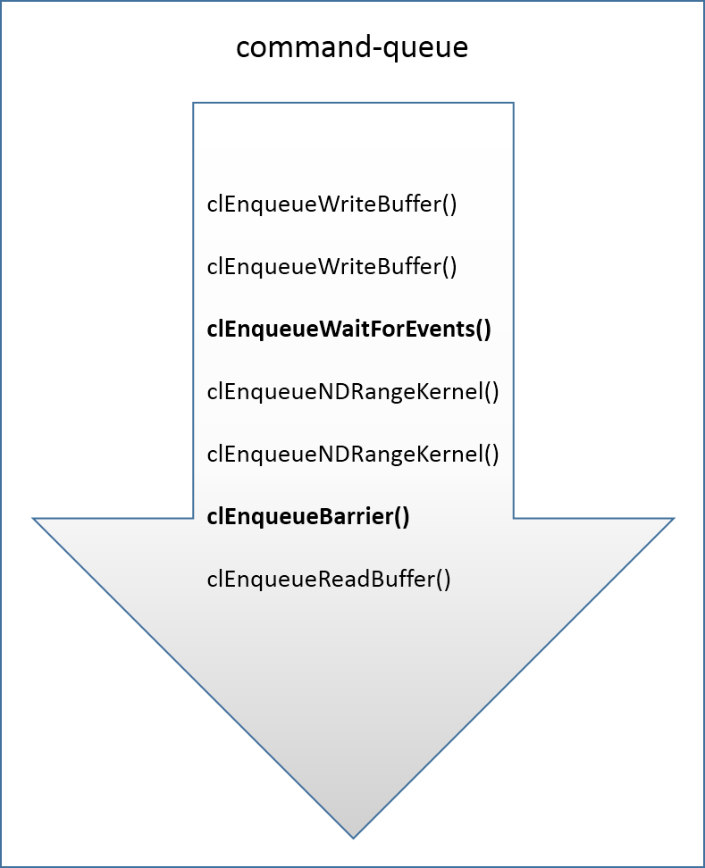
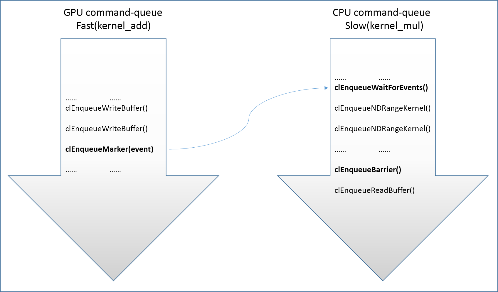

## 概述
内核代码的执行以及内存对象的操作，需要通过将 OpenCL 命令提交到命令队列来完成。在大多数情况下，我们只有一个命令队列，并且命令队列中的命令在执行时按照函数调用的顺序。但是在某些场景下并非如此，例如，当平台有多个 OpenCL 设备需要同时执行来提升性能；或者同一命令队列中的命令需要同时执行来提高并行度；抑或是应用程序需要跟踪命令的执行，来剖析程序的性能。这时候，为了保证命令的正确执行顺序，就需要在命令队列中、或者命令队列之间执行同步操作。

## out-of-order VS in-order
调用 OpenCL 函数将命令提交到命令队列时，命令在命令队列中是按照函数调用顺序存放的。但是在命令执行时，其执行顺序并不一定和命令提交到命令队列的顺序一致。在创建命令队列的时候，可以通过设置 clCreateCommandQueue 函数的 `properties` 参数来指定命令队列中的命令是以 `in-order` 还是 `out-of-order` 的方式执行。

创建命令队列时，如果没有为命令队列设置 `CL_QUEUE_OUT_OF_ORDER_EXEC_MODE_ENABLE` 属性，提交到命令队列的命令将按照 `in-order` 的方式执行。在这种执行方式下，如果应用程序首先调用 `clEnqueueNDRangeKernel` 来执行内核 A，接着又调用 `clEnqueueNDRangeKernel` 来执行内核 B，可以认为内核 A 在 内核 B 之前完成。这时，如果内核 A 输出的内存对象作为内核 B 的输入，内核 B 将正确访问到内核 A 生成的数据。反之，如果在创建命令队列时设置了 `CL_QUEUE_OUT_OF_ORDER_EXEC_MODE_ENABLE` 属性，则不能保证内核 A 在内核 B 开始之前已经执行完成。

在创建命令队列时，为命令队列设置 `CL_QUEUE_OUT_OF_ORDER_EXEC_MODE_ENABLE` 属性，应用程序调用 OpenCL 函数把命令提交到命令队列后，将按照 `out-of-order` 的方式执行。在 `out-of-order` 执行模式下，不能保证提交到命令队列中的命令是按照函数调用的顺序执行。例如，上面通过调用 `clEnqueueNDRangeKernel` 来执行内核 A 和内核 B 的阐述中，内核 B 可能在内核 A 之前执行完成。为了保证两个内核以一个特定的顺序执行，可以使用`事件同步`机制。执行内核 A 时使用 event 事件对象来标识该命令，在随后调用 clEnqueueNDRangeKernel 执行内核 B 时，将 event 事件对象作为其 `event_wait_list` 参数成员。

除了`事件同步`可以用于多个内核执行时的同步，clEnqueueWaitForEvents（等待事件） 和 clEnqueueBarrier（屏障） 命令也可以提交到命令队列用于同步。`等待事件`命令保证在它之后的命令执行之前，之前提交到命令队列的命令（使用事件列表来标识）已经执行完成；屏障命令保证在后面的命令执行之前，它前面提交到命令队列的命令已经执行完成。

同理，如果为命令队列设置了 `CL_QUEUE_OUT_OF_ORDER_EXEC_MODE_ENABLE` 属性，OpenCL 函数调用中，在 clEnqueueNDRangeKernel、clEnqueueTask 和 clEnqueueNativeKernel 命令之后提交到命令队列的读、写，拷贝和映射内存对象等命令，并不能保证会等待内核执行完成。为了保证正确的命令执行顺序，clEnqueueNDRangeKernel、clEnqueueTask 和 clEnqueueNativeKernel 返回的事件对象可以用来将一个`等待事件`提交到命令队列，或者将一个`屏障`命令提交到命令队列，以保证在读/写内存对象之前内核已经执行完成。

## 函数描述
#### 1.标记
把标记命令提交到命令队列。
```c
cl_int clEnqueueMarker(cl_command_queue command_queue,
	cl_event *event)
```
将`标记`命令提交到命令队列 `command_queue` 中。当标记命令执行后，在它之前提交到命令队列的命令也执行完成。该函数返回一个事件对象 `event`，在它后面提交到命令队列的命令可以等待该事件。例如，随后的命令可以等待该事件以确保标记之前的命令已经执行完成。如果函数成功执行返回 CL_SUCCESS。

#### 2.屏障
提交屏障命令到命令队列。
```c
cl_int clEnqueueBarrier(cl_command_queue command_queue)
```
屏障表示一个同步点，保证所有在它之前提交到命令队列 `command_queue` 的命令，在随后的命令执行之前已经执行完成。成功执行返回 CL_SUCCESS。

和 clFinish 不同的是该命令会异步执行，在 clEnqueueBarrier 返回后，线程可以执行其它任务，例如分配内存、创建内核等。而 clFinish 会阻塞当前线程，直到命令队列为空（所有的内核执行/数据对象操作已完成）。对 clFinish 的描述参见  [No.7_1_OpenCLSyncHost]()。

#### 3.等待事件
把等待事件命令提交到命令队列。
```c
cl_int clEnqueueWaitForEvents(cl_command_queue command_queue,
	cl_uint num_events,
	const cl_event *event_list)
```
将`等待事件`命令提交到命令队列 `command_queue` 中。当该命令执行完后，事件列表 `event_list` 中对应的命令已经执行完成。事件列表 `event_list` 中对应的事件必须和命令队列 `command_queue` 处于同一个上下文。成功执行返回 CL_SUCCESS。

和 clWaitForEvents 不同的是该命令执行后会立即返回，线程可以在不阻塞的情况下接着执行其它任务。而 clWaitForEvents 会进入阻塞状态，直到事件列表 `event_list` 中对应的事件处于 `CL_COMPLETE` 状态。

## 示例程序
本文通过两个示例程序分别介绍 OpenCL 命令队列中命令的同步和命令队列之间的同步。

###命令队列的同步
为了提高任务执行时的并行度，在创建命令队列时，为命令队列设置了 `CL_QUEUE_OUT_OF_ORDER_EXEC_MODE_ENABLE` 属性，提交到命令队列的命令将按照 `out-of-order` 的方式执行。提交到命令队列中的命令顺序如下图所示：



下面摘取部分操作进行描述，完整代码参见 [No.1_OpenCLSyncQueue](http://download.csdn.net/detail/bob_dong/9814000)。

#### 1.创建命令队列
在创建命令队列时，为命令队列设置了 `CL_QUEUE_OUT_OF_ORDER_EXEC_MODE_ENABLE` 属性，提交到命令队列的 OpenCL 命令将按照 `out-of-order` 的方式执行。
```c
cl_command_queue queue;

queue = clCreateCommandQueue(context, device,
	CL_QUEUE_OUT_OF_ORDER_EXEC_MODE_ENABLE, &err);
```

#### 2.等待事件操作
将 [No.7_3_OpenCLSyncEvent](http://blog.csdn.net/bob_dong/article/details/69664952) 中 clWaitForEvents 替换为 clEnqueueWaitForEvents，在调用  clEnqueueWaitForEvents 后将立即返回。这样线程不会阻塞，接下来可以通过 malloc 函数分配内存，提高任务并行度。
```c
int *dst_buffer;

cl_event event[2] = {event1, event2};
clEnqueueWaitForEvents(queue, 2, event);

// create destination buffer
dst_buffer = (int *)malloc(size);
if (!dst_buffer) {
        printf("alloc memory fail\n");
}
```

#### 3.屏障操作
使用屏障命令确保提交到命令队列中的命令按照函数调用顺序执行。
```c
// execute kernel. Memory object should be ready
err = clEnqueueNDRangeKernel(queue, kernel_add, 1,
        0, &global_size, &max_work_group_size,
        0, NULL, &event3);

// execute (mul) kernel, wait for event3 to prepary data
err = clEnqueueNDRangeKernel(queue, kernel_mul, 1,
        0, &global_size, &max_work_group_size,
        1, &event3, NULL);

clEnqueueBarrier(queue);  // ①

// read destination memory object to buffer
err = clEnqueueReadBuffer(queue, mem_dst_obj, CL_TRUE, 0,
        size, dst_buffer, 0, NULL, NULL);
```
如果将位置 ① 的屏障操作去掉，由于命令队列中的命令按照 `out-of-order` 方式执行，这时 clEnqueueReadBuffer 命令就可能在 clEnqueueNDRangeKernel 之前执行完成，这将导致从内存对象中读取的数据可能不正确。

###命令队列间同步
示例程序在 Ubuntu 上运行，该平台包含了两个 OpenCL 设备（CPU 和 GPU）。在程序执行时，为两个设备分别创建了命令队列，接着将任务分配到两个设备上执行。命令队列间的同步使用了`标记`和`等待事件`，以及`事件同步`机制，如下图所示：



摘取部分代码如下。将`标记`命令提交到 GPU 设备对应的命令队列中，用来标识对内存对象的写操作。同时，在 CPU 设备对应的命令中提交 `等待事件` 命令，该命令会以异步方式等待`标记`命令执行完成后，才执行命令队列中它身后的命令。完整代码参见 [No.2_OpenCLSyncQueue](http://download.csdn.net/detail/bob_dong/9814002)。

```c
cl_event event_marker;

clEnqueueMarker(queue[DEVICE_GPU], &event_marker);
……
clEnqueueWaitForEvents(queue[DEVICE_CPU], 1, &event_marker);
```

在 Ubuntu 系统下，该平台包含了两个 OpenCL 设备。程序运行结果如下所示：
```c
xbdong@xbdong-opencl:~/Project/github/OpenCL$ ./OpenCLSyncQueue
[Platform Infomation]
platform name: AMD Accelerated Parallel Processing

[Device Infomation]
device name: Intel(R) Core(TM) i5-4590 CPU @ 3.30GHz
device name: Baffin

[Result]
Success
```

## 参考
- [The OpenCL Specification, Version: 1.1](https://www.khronos.org/registry/OpenCL/specs/opencl-1.1.pdf)
- OpenCL Programming Guide
- [clFinish & clEnqueueBarrier](http://stackoverflow.com/questions/13200276/what-is-the-difference-between-clenqueuebarrier-and-clfinish)


