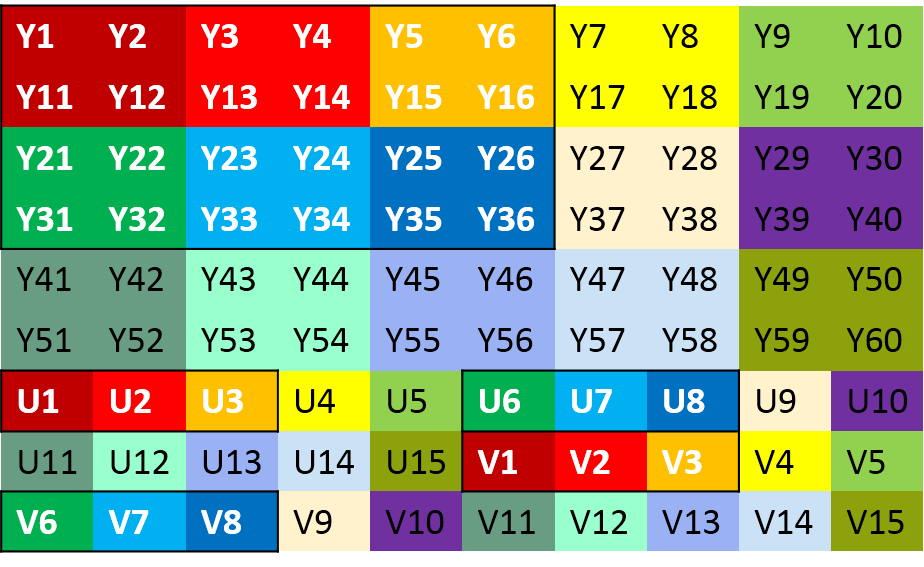
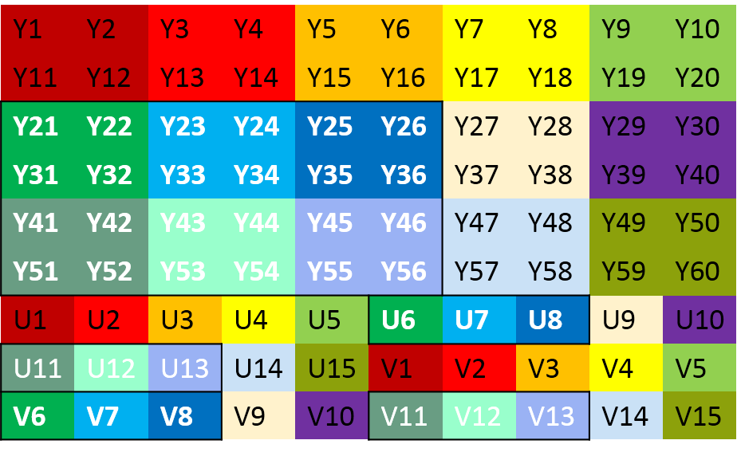
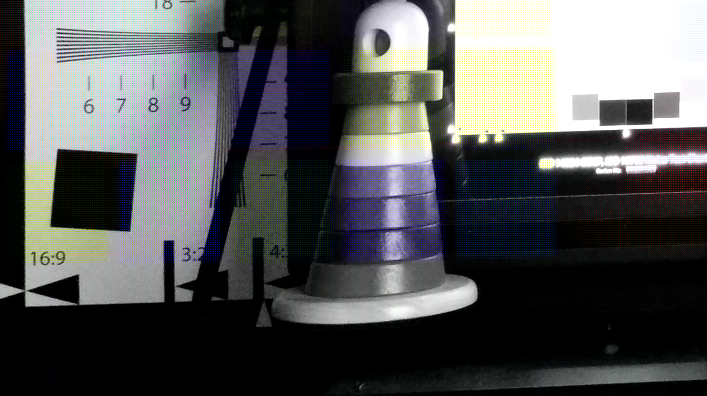
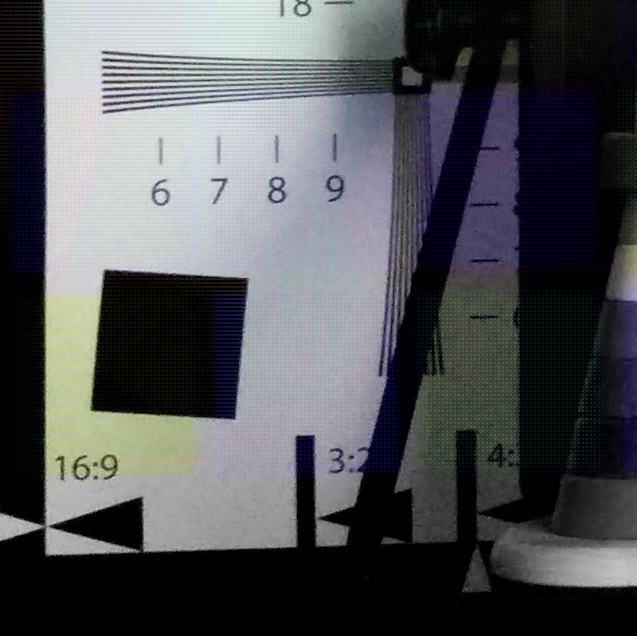

## 概述
在 [No.5_OpenCLRotate](../../No.5_OpenCLRotate/OpenCLRotate.md) 中对一张大小为 3264x2448 的 YUV420p 图像旋转后，由于显示器的分辨率只有 1920x1080，不能完全显示整张图像，于是不能直观的确定旋转正确与否。为了进一步确认旋转算法的正确性，将原始图像裁剪为较小的图像。裁剪方法是从原始图像的左上角或左下角切割一块期望大小的图像。

## 实现
### 1.提取左上角
从左上角开始，提取一块矩形区域的像素，作为 YUV420p 图形格式。如下图所示，分别提取原始图像的 Y、U 和 V 分量，使用黑框圈起来白色字体描述。



下面是使用 c 语言实现该算法的相关代码：
```c
void yuv420p_left_top(uint8_t *img_buffer, uint8_t *out_buffer,
	int img_orig_width, int img_orig_height, int img_width, int img_height)
{
	int i, j, k = 0;

	int orig_y_size = img_orig_width * img_orig_height,
	    orig_u_size = orig_y_size >> 2;

	/* copy Y section */
	for (i = 0; i < img_height; i++) {
		for (j = 0; j < img_width; j++) {
			out_buffer[k] = img_buffer[i * img_orig_width + j];
			k++;
		}
	}

	/* copy u section */
	for (i = 0; i < img_height/2; i++) {
		for (j = 0; j < (img_width/2); j++) {
			out_buffer[k] = img_buffer[orig_y_size + i * (img_orig_width/2) + j];
			k++;
		}
	}

	/* copy v section */
	for (i = 0; i < img_height/2; i++) {
		for (j = 0; j < (img_width/2); j++) {
			out_buffer[k] = img_buffer[orig_y_size + orig_u_size + i * (img_orig_width/2) + j];
			k++;
		}
	}
}
```

### 2.提取左下角
提取左下角一块矩形区域的像素，作为 YUV420p 图形格式。如下图所示，分别提取原始图像的 Y、U 和 V 分量，使用黑框圈起来白色字体描述。



下面是使用 c 语言实现该算法的相关代码：
```c
void yuv420p_left_bottom(uint8_t *img_buffer, uint8_t *out_buffer,
	int img_orig_width, int img_orig_height, int img_width, int img_height)
{
	int i, j, k = 0;

	int orig_y_size = img_orig_width * img_orig_height,
	    orig_u_size = orig_y_size >> 2;

	/* copy Y section */
	// height from (img_orig_height - img_height)
	for (i = img_orig_height-img_height; i < img_orig_height; i++) {
		for (j = 0; j < img_width; j++) {
			out_buffer[k] = img_buffer[i * img_orig_width + j];
			k++;
		}
	}

	/* copy u section */
	for (i = (img_orig_height-img_height)/2; i < img_orig_height/2; i++) {
		for (j = 0; j < (img_width/2); j++) {
			out_buffer[k] = img_buffer[orig_y_size + i * (img_orig_width/2) + j];
			k++;
		}
	}

	/* copy v section */
	for (i = (img_orig_height-img_height)/2; i < img_orig_height/2; i++) {
		for (j = 0; j < (img_width/2); j++) {
			out_buffer[k] = img_buffer[orig_y_size + orig_u_size + i * (img_orig_width/2) + j];
			k++;
		}
	}
}
```

## 示例
原始图像的大小为 1280x720，截取其左上角矩形区域，生成 640x640 的图像。程序中对原始图像的大小采用了硬编码，后续可以将原始图像的文件名和大小及相关属性作为参数传递给可执行程序。

### 1.生成图像
执行程序，生成截取的图像，图像格式以 YUV420p 格式保存。
```bash
xbdong@ubuntu:~/xxxxx/No.1_YUV420pScissor$ ./yuv420p_scissor
```

### 2.播放图像
使用 ffplay 程序来播放 YUV 格式的图像，参数如下：
```bash
xbdong@ubuntu:~/xxxxx/No.1_YUV420pScissor$ ffplay -fs -f rawvideo -video_size 1280x720 ghost_yuv420p_1280x720.yuv
xbdong@ubuntu:~/xxxxx/No.1_YUV420pScissor$ ffplay -fs -f rawvideo -video_size 640x640 yuv420p_640x640.yuv
```
如果需要全屏显示，播放图像的时候在 ffplay 命令下添加参数 `-fs` 即可。

### 3.保存图像
使用 ubuntu 的截屏功能可以将显示的图像以图片的形式保存。

> 全屏显示的时候，在 ubuntu 下截屏快捷键不起作用，可以使用 scrot 的延时截屏功能。图片默认保存在当前目录下。

```bash
xbdong@ubuntu:~/xxxxx/No.1_YUV420pScissor$ scrot -d 10 &
```
### 4.显示
下面的两张图片分别显示的是原始图像和从原始图像的左上角提取的图像，效果如下：

** 原始图像(1280x720) **



** 裁剪图像(640x640) **




